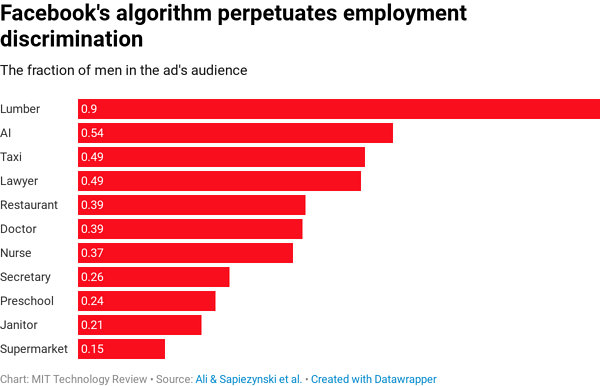

# Artificial Intelligence

If you are new to Artificial Intelligence and machine learning, there is one place to go: the [machine learning glossary](https://developers.google.com/machine-learning/glossary) from the Google developers documentation.

For the complete bibliography, please look at the [bibliography](bibliography.tsv) file.

## Train yourself 🤓

* [Best Deep Learning Courses: Updated for 2019](https://blog.floydhub.com/best-deep-learning-courses-updated-for-2019/)
* [Best Deep Learning Books: Updated for 2019](https://blog.floydhub.com/best-deep-learning-books-updated-for-2019/)
* [A Visual Exploration of Gaussian Processes](https://distill.pub/2019/visual-exploration-gaussian-processes/) - Discovering or rediscovering Gaussian Processes in an interactive fashion.

## Embedding 🎹

* [FaceNet: A Unified Embedding for Face Recognition and Clustering](https://arxiv.org/abs/1503.03832) - A solution which transforms an image into a compact Euclidean space allowing to enhance Face Recognition. [implementation](https://github.com/davidsandberg/facenet) _(`Embedding`, `image2vec`, `Tensorflow`)_
* [Grasp2Vec: Learning Object Representations from Self-Supervised Grasping](https://arxiv.org/abs/1811.06964) - Embedding used in reinforcement learning to represent reality through physical world robot grasping. [Google article](https://ai.googleblog.com/2018/12/grasp2vec-learning-object.html) _(`Embedding`, `image2vec`, `RL`)_

## Natural Language Processing and voice recognition 🗣

* Assisted writings
  * ["I want to live"](https://youtu.be/BhKw71AeOg4) - A 60 second clip entirely scripted from an AI studying 15 years of worth of award-winning ads.
  * [Bertie the Forbes' CMS](https://digiday.com/media/forbes-built-a-robot-to-pre-write-articles-for-its-contributors/) - Forbes [announced](https://www.forbes.com/sites/forbesproductgroup/2018/07/11/entering-the-next-century-with-a-new-forbes-experience/#5e9b28803bf4) its new AI powered CMS (Content Management System) where AI helps and support content creator from image selection to draft article writings.
* [Accurate Online Speaker Diarization with supervised learning](https://ai.googleblog.com/2018/11/accurate-online-speaker-diarization.html) - Detect interlaced speakers in a speech. But beware, code is not the original and you cannot access data. _(`PyTorch`, `Embedding`)_

## Semantic segmentation ✏️

Semantic segmentation is the practice of categorizing an image at the pixel level. i.e., semantic segmentation assigns a class to each pixel in an image. Semantic segmentation was at the heart of our core products at Redbird. There are a lot activities around that topic where state of the art is still not as accurate as human. I have written a [medium post](https://medium.com/@hervenivon/crafting-the-future-was-just-the-beginning-herve-nivon-3b7312a73184) where you will find further information regarding our projects.

Here are the most relevant findings we leverage for our project and some more recent ones that can enhance it:

* [Auto-DeepLab: Hierarchical Neural Architecture Search for Semantic Image Segmentation](https://arxiv.org/abs/1901.02985) - The next DeepLab generation which was already the state of the art in this field.
* [Multi-Task Learning Using Uncertainty to Weigh Losses for Scene Geometry and Semantics](https://arxiv.org/abs/1705.07115) - Multi-task learning for segmentation and instance segmentation with a multi-task loss.
* [Panoptic Feature Pyramid Networks](https://arxiv.org/abs/1901.02446) - Unified architecture for multi task segmentation and instance segmentation.

## Datasets 💽

* [AWS OpenData](https://aws.amazon.com/opendata/)
* [Adding Diversity to Images with Open Images Extended](https://ai.googleblog.com/2018/12/adding-diversity-to-images-with-open.html)
* [BigQuery Datasets](https://cloud.google.com/bigquery/public-data/)
* [Datasetlist](https://www.datasetlist.com/)
* [Kaggle Datasets](https://www.kaggle.com/datasets)
* [Open Images Dataset V4](https://storage.googleapis.com/openimages/web/index.html)
* [UCI Machine Learning repository](https://archive.ics.uci.edu/ml/datasets.html)

## Data annotation 📝

* [List of manual image annotation tools](https://en.wikipedia.org/wiki/List_of_manual_image_annotation_tools) - The list of annotation tools is long, unfortunately the Wikipedia rule enforce certain criteria I think are not smooth enough to enable tool discovery in fast pace changing environments. In that case, please take a look at the [talk](https://en.wikipedia.org/wiki/Talk:List_of_manual_image_annotation_tools) page of this article, there is pletoria of tools to discover here.
* Polygon-RNN:
  * [Efficient Interactive Annotation of Segmentation Datasets with Polygon-RNN++](https://www.youtube.com/watch?v=evGqMnL4P3E)
  * [Demo](http://www.cs.toronto.edu/polyrnn/)
* Curve-GCN:
  * [Fast Interactive Object Annotation with Curve-GCN](https://arxiv.org/abs/1903.06874) - Graph Convolutional Network (GCN) leveraged to speedup manual objects annotation. Trained on Cityscape, yet generalized on other data types such as Aerial or Medicine. Advertised to be 10 to 100 times faster that polygon-RNN.
  * ["Code"](https://github.com/fidler-lab/curve-gcn) - You need to signup to get an access to the code!
  * [Video](https://youtu.be/ycD2BtO-QzU?t=164)
* [doccano](https://github.com/chakki-works/doccano) - Open source text annotation tool
* [A Guide to Learning with Limited Labeled Data](https://blog.fastforwardlabs.com/2019/04/02/a-guide-to-learning-with-limited-labeled-data.html) - This overview guide to active learning comes with a neat and inspiring [prototype](https://activelearner.fastforwardlabs.com/).

Annotation as services:

* [supervise.ly](supervise.ly) - Is a an online service that enable automatic annotation of data. Fron the tens I tested it is my current favorite.
* [Alegion](https://alegion.com) - Annotation service that deals with computer vision, NLP, and data cleansing. The service alleges to combine machine learning and Human intelligence.
* [Scale.ai](https://scale.ai/) - With a "simple" API to programmaticaly request Human annotation from their service, Scale.ai aims to free projects from the annotation task.

## Data Generation 🖌

### Face and ImageNet generation 🎭

* [Inside the world of AI that forges beautiful art and terrifying deepfakes](https://www.technologyreview.com/s/612501/inside-the-world-of-ai-that-forges-beautiful-art-and-terrifying-deepfakes/) - A 2018 overview of GAN and latests progress in the field of generative networks.
* [A Style-Based Generator Architecture for Generative Adversarial Networks](https://arxiv.org/abs/1812.04948) - Here we are, on December 2018 we discovered than a computer can generate images that we can definitely take for real ones. [summary](https://www.technologyreview.com/s/612612/these-incredibly-real-fake-faces-show-how-algorithms-can-now-mess-with-us/).
* [High-Fidelity Image Generation With Fewer Labels](https://arxiv.org/abs/1903.02271) - This paper proposes a solution to achieve state of the art GAN performance on ImageNet with 10% of the labels. [Blog announcement](https://ai.googleblog.com/2019/03/reducing-need-for-labeled-data-in.html)

### Scenes generation 🌄

* [AI software can dream up an entire digital world from a simple sketch](https://www.technologyreview.com/s/612503/ai-software-can-dream-up-an-entire-digital-world-from-a-simple-sketch/) - A photorealistic 3D engine renderer made out of GAN.
* [GauGAN Turns Doodles into Stunning, Photorealistic Landscapes](https://blogs.nvidia.com/blog/2019/03/18/gaugan-photorealistic-landscapes-nvidia-research/) - This NVIDIA last sketch to photo GAN network based application - named GauGAN - results are unbelievable. [repository](https://github.com/NVlabs/SPADE), [paper](https://arxiv.org/abs/1903.07291)

### Object generation 🕸

* [Visual Object Networks: Image Generation with Disentangled 3D Representation](http://papers.nips.cc/paper/7297-visual-object-networks-image-generation-with-disentangled-3d-representations.pdf) - How a set of specialized networks learn to generate 3D objects.
* [This is the most complex generative design ever made](https://www.fastcompany.com/90269399/this-is-the-most-complex-generative-design-ever-made) - Purely inspirational, no implementation design, still further details are accessible [here](https://www.autodesk.com/solutions/generative-design).

## Understanding the black box ◼️

One of the main challenges we face when we interact with artificial intelligence projects is to reproduce results, understand how they work, and explain decisions. Neural networks are known as black boxes, famously known for being impenetrable.

The European Union's General Data Protection Regulation (GDPR) which is designed to ensure and to strengthen data security and privacy of all 28 EU members states' citizen including data held outside of the EU either the data is related to employees or customers includes rights to explanation [1](https://www.csoonline.com/article/3251727/is-the-gdpr-s-right-to-explanation-a-game-changer-for-security-analytics.html), [2](https://iapp.org/news/a/is-there-a-right-to-explanation-for-machine-learning-in-the-gdpr/):

1. _Article 22_: Grants citizens “the right not to be subject to a decision based solely on automated processing” that “significantly affects him or her.”
1. _Recital 71_: The data subject should have “the right... to obtain an explanation of the decision reached... and to challenge the decision.”
1. _Article 13_: The data controller must provide the subject, at the time his or her personal data is obtained, with “meaningful information about the logic involved, as well as the significance and the envisaged consequences of such processing” for the subject.
1. _Article 15_: Subjects have a right to know what personal data a company is using and how it’s being used.

With that in mind, most businesses claiming to use AI or using AI without declaring it then have a complicated puzzle to solve. They must be able to explain any algorithm driven decision implying a Human.

We are seeing more and more attempts to understand and interpret them, to unpack their choices, to reproduce experiments, and to debug them.

You must be careful with whoever tells he can surely explain how a deep learning model takes a decision. Still a cutting edge research topic.

* [A New Approach to Understanding How Machines Think](https://www.quantamagazine.org/been-kim-is-building-a-translator-for-artificial-intelligence-20190110) - An interview of Been Kim from Google Brain for the introduction of “Testing with Concept Activation Vectors” [TCAV](https://arxiv.org/abs/1711.11279)
* [A neural network can learn to organize the world it sees into concepts—just like we do](https://www.technologyreview.com/s/612746/a-neural-network-can-learn-to-organize-the-world-it-sees-into-conceptsjust-like-we-do) - In this [paper](https://arxiv.org/abs/1811.10597), GAN are examined under a microscope, it is a major leap forward into comprehension of GANs.
* [Exploring Neural Networks with Activation Atlases](https://distill.pub/2019/activation-atlas/) - Feature inversion support an activation atlas of features the network has learned. And you can play with it! [Blog](https://ai.googleblog.com/2019/03/exploring-neural-networks.html) announcement.
* [Four Experiments in Handwriting with a Neural Network](https://distill.pub/2016/handwriting/) - Interactive experiments to understand network based on your handwriting inputs
* [ICLR Reproducibility Challenge](https://reproducibility-challenge.github.io/iclr_2019/) - A challenge that encourage people to try reproducing a paper from the 2019 ICLR submissions. The goal is to assess that the experiments are reproducible.
* [Machine Learning for Kids](https://machinelearningforkids.co.uk/) - If you want my mind, it is valuable not only for kids 😅
* [The Building Blocks of Interpretability](https://distill.pub/2018/building-blocks/) - A reproducible paper that combines different technics in order to better understand networks.
* [The Machine Learning Reproducibility Checklist](https://www.cs.mcgill.ca/~jpineau/ReproducibilityChecklist.pdf) - It is so hard to reproduce today's publication that some initiatives like this reproducibility checklist arise and provide rules to follow.
* [awesome-machine-learning-interpretability](https://github.com/jphall663/awesome-machine-learning-interpretability) - Another awesome list dedicated to machine learning interpretability, it wants itself to be an incomplete, imperfect blueprint for a more human-centered, lower-risk machine learning.
* [comet.ml](https://comet.ml) - An online platform compatible with any Machine Learning framework that aggregate online stats and enable model comparison.
* [distill.pub](https://distill.pub/) - This is an attempt to modernize the main issues we face with the traditional printed scientific papers in computer science and machine learning which now more than ever involve an overabundant amount of data and are nearly impossible to understand on a sheet of paper. Distill.pub brings clarity, reproducibility, and interactivity. `PDF` files are from another age. `distill.pub` is an expression of our time.
* [manifold](https://eng.uber.com/manifold/) - A platform from uber that promises ease of debugging, not publicly shared, not available for test, pretty, and a lot of ideas still.

## Performance and hardware 🏎

* [A full hardware guide to Deep Learning](http://timdettmers.com/2018/12/16/deep-learning-hardware-guide/) - If you want to build your own local hardware for training, this is a must read.
* [Best Deals in Deep Learning Cloud Providers](https://towardsdatascience.com/maximize-your-gpu-dollars-a9133f4e546a) - Where does it more effective to train your models. AWS is the most expensive.
* [GPipe introduction](https://ai.googleblog.com/2019/03/introducing-gpipe-open-source-library.html) - From Mini- to Micro-Batches, GPipe partitions a model (Model parallelism) across different accelerators to efficiently train large-scale neural network models.

## Ethics 👴🏻

All algorithms [are biased](https://www.technologyreview.com/s/612876/this-is-how-ai-bias-really-happensand-why-its-so-hard-to-fix/); Facebook’s is no exception.

United States of America Department of Housing and Urban Development [sued Facebook on the 28th of March 2019](https://www.hud.gov/sites/dfiles/Main/documents/HUD_v_Facebook.pdf). The HUD alleged that the paying Facebook ads service let advertisers purposefully target their ads based on race, color, religion, sex, familial status, national origin or disability.

This is the tip of the iceberg; bias can be found in a lot of places in artificial intelligence projects. The following is a result of a set of celebration images.

A "simple" analysis of the ImageNet [images origin](https://www.nature.com/articles/d41586-018-05707-8) gives clues on the bias reasons.

This paragraph focuses on fact analysis and key initiatives.

* [7 essentials for achieving trustworthy AI](http://europa.eu/rapid/press-release_IP-19-1893_en.htm) - The seven ethics principles from the European Commission regargind Artificial Intelligence development. "Trustworthy AI should respect all applicable laws and regulations, as well as a series of requirements":
  1. **Human agency and oversight**: AI systems should enable equitable societies by supporting human agency (*ed: the capacity to act independently and to make their own free choices*) and fundamental rights, and not decrease, limit or misguide human autonomy.
  1. **Robustness and safety**: Trustworthy AI requires algorithms to be secure, reliable and robust enough to deal with errors or inconsistencies during all life cycle phases of AI systems.
  1. **Privacy and data governance**: Citizens should have full control over their own data, while data concerning them will not be used to harm or discriminate against them.
  1. **Transparency**: The traceability of AI systems should be ensured.
  1. **Diversity, non-discrimination and fairness**: AI systems should consider the whole range of human abilities, skills and requirements, and ensure accessibility.
  1. **Societal and environmental well-being**: AI systems should be used to enhance positive social change and enhance sustainability and ecological responsibility.
  1. **Accountability**: Mechanisms should be put in place to ensure responsibility and accountability for AI systems and their outcomes.
* [AI Safety Needs Social Scientists](https://distill.pub/2019/safety-needs-social-scientists/) - An extensive explanation towards the Social Scientists requirement explanation.
* [Advanced Technology External Advisory Council (ATEAC)](https://www.technologyreview.com/s/613203/google-appoints-an-ai-council-to-head-off-controversy-but-it-proves-controversial/) - The idea was that a team made of philosophers, engineers, and policy experts would have regulated Google's AI projects based on [AI principles](https://www.blog.google/technology/ai/ai-principles/). The controversy raised by this initiative was so high than in less than a month the initiative [has been canceled](https://www.vox.com/future-perfect/2019/4/4/18295933/google-cancels-ai-ethics-board). Actually, [1720 Google employees have signed a petition](https://thehill.com/policy/technology/437278-google-in-tough-spot-over-conservative-pick-for-ai-board) asking the company to remove Kay Cole James, the president of the conservative Heritage Foundation, from the panel. Despite all that noise, I see here a trend and a light on a growing issue with artificial intelligence projects and their potential impacts on real lives.
* [China’s top AI scientist drives development of ethical guidelines](https://www.scmp.com/news/china/science/article/2181573/chinas-top-ai-scientist-drives-development-ethical-guidelines) - Yes it is time for the world to align itself on where it wants to go
* [Counteroffensive against GPT-2](http://gltr.io/) - Perpetuating the long tradition of cat and mouse play, a new AI developed by researchers at MIT, IBM’s Watson A.I. Lab and Harvard University has been built to detect text generated by AI and therefore providing a tool to fight fake news! It comes with a nice [demo](http://gltr.io/dist/index.html)
* [GPT-2 blog post announcement](https://openai.com/blog/better-language-models/) - OpenAI released a blog post along their paper [Language Models are Unsupervised Multitask Learners](https://d4mucfpksywv.cloudfront.net/better-language-models/language_models_are_unsupervised_multitask_learners.pdf) explaining why they won't share reproducibility parameters (regarding data and hyperparameters notably). The GPT-2 performances are unbelievable and in the absence of clear ethics in the artificial intelligence field I can't agree more at that time. Nevertheless, I'm utterly frustrated. We need to do something about the social implications of artificial intelligence. In the [OpenAI’s GPT-2: the model, the hype, and the controversy](https://towardsdatascience.com/openais-gpt-2-the-model-the-hype-and-the-controversy-1109f4bfd5e8) blog post, the idea of a ‘safety checklist’; similarly to the recent ‘[reproducibility checklist](https://www.cs.mcgill.ca/~jpineau/ReproducibilityChecklist.pdf)’ arises. Why not?!
* [Google is trying to remove gender bias from its translation services](https://www.fastcompany.com/90278118/google-is-trying-to-remove-gender-bias-from-its-translation-services) - Gender bias is one of the problem in engineering, mostly only male all around. It is so easy to implement those bias and transmit them to the machine.
* [Research priorities for robust and beneficial Artificial Intelligence](https://futureoflife.org/ai-open-letter/) - The first round of people who expressed worries in the current research state of AI. It should be directed toward beneficial outcomes: "our AI systems must do what we want them to do".
* [Thinking inside the box: using and controlling an Oracle AI](https://link.springer.com/article/10.1007/s11023-012-9282-2) - Controlling AI has been a problem for a while even before the rise of deep learning. In this paper, you'll discover that a particular topic can raise a lot of questions, even if it seems simple at first: here controlling an Oracle AI that doesn't act in the world except by answering questions.

## Sagemaker 🤖

[`sagemaker`](https://docs.aws.amazon.com/sagemaker/latest/dg/whatis.html) is quickly becoming a state of the art for machine learning project. It assembles under this sole name a lot of capabilities that would accelerate and standardize any launching project involving machine learning of any sort. From [collaboration](https://aws.amazon.com/blogs/machine-learning/amazon-sagemaker-notebooks-now-support-git-integration-for-increased-persistence-collaboration-and-reproducibility) to [continuous deployment of model](https://aws.amazon.com/blogs/machine-learning/automated-and-continuous-deployment-of-amazon-sagemaker-models-with-aws-step-functions), through [ground truth generation](https://aws.amazon.com/blogs/aws/amazon-sagemaker-ground-truth-build-highly-accurate-datasets-and-reduce-labeling-costs-by-up-to-70) `sagemaker` provides all necessary tools for most of the use cases.

The initial version of `sagemaker` has been released on [Nov 29, 2017](https://aws.amazon.com/about-aws/whats-new/2017/11/introducing-amazon-sagemaker/). As we were working on machine learning projects applied to production in early 2016, we needed to figured out by ourselves and our small team how to build, train and deploy our custom models. Spending a consequent amount of time in setting the instances, installing latest version - available at that time - of `cuda` and `tensorflow` and connecting the dots in the process.

If I would start something new today, `sagemaker` would be my primary target as a CTO, helping my future team to focus on the value added, not the infrastructure and process on which everyone - starting with AWS - is working on.

A `sagemaker` workflow for continuous deployment © [AWS](https://aws.amazon.com/blogs/machine-learning/automated-and-continuous-deployment-of-amazon-sagemaker-models-with-aws-step-functions):

`sagemaker` use cases demonstration:

* [Analyzing live video](https://aws.amazon.com/blogs/machine-learning/analyze-live-video-at-scale-in-real-time-using-amazon-kinesis-video-streams-and-amazon-sagemaker/)
* [Classifying high-resolution chest x-ray medical images with Amazon SageMaker](https://aws.amazon.com/blogs/machine-learning/classifying-high-resolution-chest-x-ray-medical-images-with-amazon-sagemaker/)

other `sagemaker` key features:

* [Pipe mode](https://aws.amazon.com/blogs/machine-learning/accelerate-model-training-using-faster-pipe-mode-on-amazon-sagemaker/) - It allows to stream data directly from an `S3` bucket without the need to download the data on the machine. It leverages the [protobuf](https://developers.google.com/protocol-buffers/) to speedup streaming from S3 to the training instances.

## Setting an artificial intelligence project 📈

Executing an enterprise grade artificial intelligence project is complicated, a lot of steps are necessary in a highly uncertain context. As of today, you have a lot of choices to set your projects right. Depending on your team size, you might even willing to reinvent the wheel suffering from the ["Not Invented Here"](https://en.wikipedia.org/wiki/Not_invented_here) syndrome. The good news is there is a lot to learn from the already maturing industry.

In its [Machine Learning Maturity Model](https://arxiv.org/abs/1811.04871) IBM presents a set of best practices to implement when a company wants to deploy artificial intelligence projects at scale and in a friendly fashion with enterprise landscape. Many of those best practices might be too complicated to achieve, anyhow, it will highlight any shortcomings in your projects and potential area of focus.

The following are some thoughts on different aspects of an artificial intelligence project.

### Defining the purpose of the system 🎯

When it come to artificial intelligence project definition I see two main purpose:

1. The business outcome: either we will automate manual activity or we will create new value,
1. The technical results of your project.

[Building safe artificial intelligence](https://medium.com/@deepmindsafetyresearch/building-safe-artificial-intelligence-52f5f75058f1) describes the nascent field of technical AI safety and propose a framework to model and understand AI system. This is the second aspect.

### The team 🎳

The [How to build a machine learning team when you are not google or facebook](https://www.wandb.com/blog/how-to-build-a-machine-learning-team-when-you-are-not-google-or-facebook) article highlights best practices that a good manager will discover himself executing an artificial intelligence project. Pragmatism has always been at the heart of our strategy including went it came to our artificial intelligence projects. I always prefered to leverage in place resources. And there is one thing for sure: as of today, "it’s more efficient to teach a engineers machine learning than to teach machine learning practitioners how to be good engineers." With the right project and the rock solid computer scientists you can kick-start an artificial intelligence project with a small team.

If you are an equivalent to Google or Facebook 😄 - written otherwise, you have the means to set a large team and set different roles, and responsibilities - [here](https://hackernoon.com/top-10-roles-for-your-data-science-team-e7f05d90d961) are twelve functions which operate on Artificial Intelligence projects. It is meant to give a taste of the variety of responsibilities. The below listing is an adaptation of the article mentioned above.

* Data Engineer: responsible for data delivery to the rest of the team. From a spreadsheet to big data engineer (block storage management, database, data lake, etc.)
* Analyst: responsible for the first set of data analysis, familiar with more advanced tools than the spreadsheet like R or programmatic data viz.
* Expert Analyst: responsible for the same tasks than the analyst at a higher speed. Faster, stronger.
* Statistician: responsible for preventing others from concluding too quickly at the end of every day.
* Applied Machine Learning Engineer: responsible for leveraging on the shelf algorithms, connecting them to your data.
* Data Scientist: responsible for all above roles except decision making.
* Qualitative Expert / Social Scientist: responsible for setting the right KPI and metrics understood by all the stakeholders.
* Researcher: responsible for solving your issues if the project is in its last resort and that you have exhausted all industry options.
* Domain expert: responsible for providing the best insight on the industry you are working, data definition, business rules, scenarios, etc.
* UX designer: responsible for getting the most out of your project putting the model into action and crafting end users interactions with it.
* Ethicist: responsible for checking the validity of your project according to a set of predetermined rules (several are available more in to come on this topic in the current page); from diversity to explainability, etc.
* Analytics Manager / Data Science Leader / Decision-Maker: responsible for team orchestration, getting the most of everyone and the data. This implies strong decision making accounting for the potential impact on business. A wide topic that heavily depends on data nature and team members. I assured that role at Airware.

Several of these roles are detailed or approached from other angles in this documentation.

### From craftsmanship to engineering 🏗

Productionizing an artificial intelligence project, tracking its progress or solely being able to reproduce an experiment is a challenge. We see traditional computing systems as deterministic: for a particular version of your code, you get specific behavior. You can upgrade your software or dependencies to a specific version to benefit some improvements or you can roll-back to a previous version of it if you face some unexpected issues. Infrastructure as code paradigm enables the same features for the underlying elements supporting your project.

For years now, continuous delivery is a well-known concept, often applied in production.

When it comes to artificial intelligence projects it is steadily way more tricky: how do you manage that so-called black box? The good news is that the black box can also be versioned. You can version an artificial intelligence project on [different axes](https://emilygorcenski.com/post/data-versioning): code, model, data schema, data values, and data annotations. There is not only one approach, and it can become highly complex. It depends on your project ambition, data variation, number of people involved, go-live frequencies, etc. You must find the most appropriate way for each project. In my experience, versioning models, associated code and data annotations have proven to be the bare minimum - and even it wasn't always sufficient to reproduce a particular experiment. Some tools or services that might assist you in this mission:

* [comet](https://comet.ml)
* [DVC](https://dvc.org)
* [qri](https://qri.io) - A distributed web version of DVC
* [MLflow](https://mlflow.org)

Another divergence from traditional computer science problems is testing and debugging. During the past 70 years, computer science engineers have established strategies and best practices for testing, debugging and ensuring code quality before deployments. The toolkit is impressive: unit tests, integration test, test driven development, performance verification, human acceptance tests, etc. Those practices are not directly applicable nor always suitable for modern artificial intelligence projects. How to formally test a network of millions of parameters? The current de facto method is to split your training database intelligently in a train set and a test set - We used to apply genetic programming to get the most of this split at Airware. But this often doesn't ensure production high performance nor robustness and doesn't verify that your models are bulletproof to worst cases or worse to hacking.

Some Tencent engineers "simply" used [little stickers](https://keenlab.tencent.com/en/whitepapers/Experimental_Security_Research_of_Tesla_Autopilot.pdf) to force the "in production" Tesla's autopilot to change lane: from the right one to the wrong one. With autonomous vehicles, it would be disastrous. With medicine, financial, insurance or retail the consequences could be just as unfortunate or painful.

The following example illustrates how changing imperceptively an image can trick a model into identifying a "Sloth" as a "Racecar" with >99% confidence. And, it gives an idea of how weak networks can be.

This is called an adversarial example: inputs to a neural network resulting in incorrect outputs. [Explaining and Harnessing Adversarial Examples](https://arxiv.org/abs/1412.6572) will provide you all technical details. [How to trick a neural network into thinking a panda is a vulture](https://codewords.recurse.com/issues/five/why-do-neural-networks-think-a-panda-is-a-vulture) will give you technical information to reproduce the experiment yourself. This [article](http://www.evolvingai.org/fooling) will provide you with yet another taste.

In [Towards Robust and Verified AI](https://medium.com/@deepmindsafetyresearch/towards-robust-and-verified-ai-specification-testing-robust-training-and-formal-verification-69bd1bc48bda) Deepmind states that machine learning systems are not robust by default and exposes three approaches for rigorously identifying and eliminating bugs in learned models to achieve Machine Learning robustness. These three approaches are directed toward ensuring that the produced system complies with its [specifications](https://medium.com/@deepmindsafetyresearch/building-safe-artificial-intelligence-52f5f75058f1).

1. **Adversarial testing**: the idea is to leverage adversarial strategies to systematize and harnessing testing over random approaches, searching for the worst case outcome. Given example illustrates that surprisingly simple adversarial example can lead to failure.
1. **Robust learning**: the idea is to build networks that are agnostic to adversarial testing changing the learning algorithms.
1. **Formal verification**: the idea is to provably demonstrate that models' predictions are consistent with a specification for all possible inputs bounding the outputs of the network.

These three approaches are in their early stage. I expect a lot more to come.

### Conclusions

* Don't reinvent the wheel, just like all other computer science project!
* Don't be afraid to get your hands dirty, if you are working on cutting edge projects, your data won't be annotated. Obviously you can outsource annotation, but one need to understand what it means.
* Be humble, the research is going really blasting [fast](https://www.technologyreview.com/s/612582/data-that-illuminates-the-ai-boom/).
* Accept failure, and be patient. Only one thing is sure, in any machine learning project you'll met failure. Reaching success might be a long way...

## Further inspiration 💡

* [Robust Website Fingerprinting Through the Cache Occupancy Channel](https://arxiv.org/abs/1811.07153) - What if you can leverage machine learning and a Javascript security hole to track anyone browsing history?
* [Track the number of coffees consumed using AWS DeepLens](https://aws.amazon.com/blogs/machine-learning/track-the-number-of-coffees-consumed-using-aws-deeplens/) - How to build a coffee tracker in the open space with AWS deeplens.
* [Deep Learning State of the Art (2019) - MIT](https://www.youtube.com/watch?v=53YvP6gdD7U) - A lecture from [@lexfridman](https://twitter.com/lexfridman) on recent developments in deep learning. That is a very good overview of 2018 state of the art in research and applied deep learning.

As we are loosing most of the [nonverbal communications](https://en.wikipedia.org/wiki/Nonverbal_communication) in a large portion of our day to day modern human to human interactions, I've always been curious on how we could extend it with expressive enhancements that would explain much more than lengthy descriptions. "A picture worths a thousand words." Some attempts:

* [Dango](https://getdango.com/) - Is an application and API to propose relevant emojis and GIFs based on your text input in messaging. This unfortunately doesn't provide the code.
* [live-mood](http://devpost.com/software/live-mood-2b5arl) - A former team member worked on a twitch extension to continuously transcribe watchers mood on a stream.

### Agriculture 🌱

* [Machine learning is making pesto even more delicious](https://www.technologyreview.com/s/613262/machine-learning-is-making-pesto-even-more-delicious/) - How machine learning was used to develop a surrogate model of Basil and provide new counter intuitive recipes. [Source paper](https://journals.plos.org/plosone/article?id=10.1371/journal.pone.0213918)

### Augmented reality 👓

* [Real-Time AR Self-Expression with Machine Learning](https://ai.googleblog.com/2019/03/real-time-ar-self-expression-with.html) - Impressive on device real time AR applied on faces. Two networks work jointly to first detect the face on the stream and second to generate the Mesh.

### Compression, enhancement 🗜

* [Learned Video Compression](https://arxiv.org/abs/1811.06981) - A traditional codec architecture where elements are replaced by Machine Learning ones. Results: the new codec outperforms all existing video codecs.

### Energy management 🔋

* [EnergyVault](https://energyvault.ch/#operating-parameters) - The cleverest idea ever regarding energy storage. Thinking out of the box is key when you are growing a startup. Here is the perfect example.
* [Tibber](https://international.tibber.com/) - Norway and Sweden based startup helps you "smartly buy electricity at the best price at the right time of the day every day".

### Experiments & Art 🎨

> On October 2018, an ink-on-canvas portrait created using artificial intelligence was sold at Christie’s New York. The first AI-generated artwork to be offered by a major auction house. The estimate was $7,000-$10,000. It went for $432,500.

The 1917 "Fountain" from Marcel Duchamp, a porcelain urinal signed "R. Mutt" arranged as a piece of art is world famous. In 1999, a replica of Marcel Duchamp’s original Fountain was purchased by Dimitri Daskalopoulos, a Greek collector, for [1.76 million dollars](https://independent-collectors.com/interviews/dimitris-daskalopoulos-arterritory/). I'm not a philosopher. I'm not an artist. I can't say what Art is. The sole fact some are discussing it is the sign that Artificial intelligence generated pieces might be art. Earth, everyday furniture, paint, pen, pencil, coffee, Lego, computers painting, and [now](https://howtospendit.ft.com/art-philanthropy/205746-artificial-intelligence-the-art-world-s-weird-and-wonderful-new-medium) artificial intelligence are to me medium to produce pieces of art: pieces that tell you something about yourself.

* Music:
  * [Semi-Conductor](https://experiments.withgoogle.com/semi-conductor) - A Google AI experiment that allow one to conduct an orchestra from the browser
* Painting:
  * [amalGAN](http://areben.com/project/amalgan/) - [Alexander Reben](http://areben.com/cv/) used brain waves, GAN network and side supportive networks to generate a set of visually unusual paintings that are physically reproduced in a Chinese town: a human-machine global collaboration.
* Spotting AI-generated faces:
  * [nikola MIT experiment](https://web.archive.org/web/20181210150931/http://nikola.mit.edu/experiment) - People at MIT had set an online test that asks you to spot generated faces with [NVIDIA's Progressive GAN](https://research.nvidia.com/publication/2017-10_Progressive-Growing-of). I tried it myself and wasn't 100% correct 😅. Some
  * [How to recognize fake AI-generated images](https://medium.com/@kcimc/how-to-recognize-fake-ai-generated-images-4d1f6f9a2842) - An extensive look into AI-generated images that will train yourself to spot fake images.
* Future is brilliant
  * [Neural Ordinary Differential Equations](https://arxiv.org/abs/1806.07366) - Explorative new family of neural network that "parameterizes the derivative of the hidden state using a neural network".
  * [Relational inductive biases, deep learning, and graph networks](https://arxiv.org/abs/1806.01261) - Advocacy for combinatory between "hand-engineering" and "end-to-end" learning in order to overcome current full deep learning approachs.
  * [AICAN HG Contemporary February exhibit](http://www.hgcontemporary.com/exhibitions/faceless-portraits-transcending-time?view=slider#5) - Faceless Portrait #5 is Terminator as an art piece. Someone will see a [disturbed AI](https://www.fastcompany.com/90307889/these-eerie-portraits-were-painted-by-a-very-disturbed-ai)

### Games 👾

* [Starcraft AI competition](http://www.cs.mun.ca/~dchurchill/starcraftaicomp/2018/aiide/) - The state of the Starcraft competition. Samsung 1st, Facebook 2nd.
* [Mortal Kombat](https://blog.mgechev.com/2018/10/20/transfer-learning-tensorflow-js-data-augmentation-mobile-net/) - A `Tensorflow.js` project that allows you to play Mortal Kombat with your webcam.
* [TensorKart](https://www.kevinhughes.ca/blog/tensor-kart) - Game played with an Xbox became training data for an off the shelf model to train an agent playing MarioKart 64. Data are all around us!

### Medicine 👩🏽‍⚕️

* [AI Is Good (Perhaps Too Good) at Predicting Who Will Die Prematurely](https://www.livescience.com/65087-ai-premature-death-prediction.html) - A deep learning model trained on genetic, physical and health data submitted by more than 500,000 people between 2006 and 2016 has been able to be "significantly more accurate" than all previous models; it has been able to correctly identify 76 percent of subjects who died prematurely during the study period.
* [Artificial Intelligence Can Detect Alzheimer’s Disease in Brain Scans Six Years Before a Diagnosis](https://www.ucsf.edu/news/2018/12/412946/artificial-intelligence-can-detect-alzheimers-disease-brain-scans-six-years) - It is not a question of time any more, it is already here.
* [Brain2Speech](https://www.sciencemag.org/news/2019/01/artificial-intelligence-turns-brain-activity-speech) - Experiment using AI to get our voice out of our head automatically. The promise to an accessible world for disable people.
* [Detection of patient mobilization activities in the ICU](https://www.nature.com/articles/s41746-019-0087-z) - How a deep learning based computer vision can help to monitor patient mobilization and to mitigate risk for post-intensive care syndrome and long-term functional impairment  in intensive care unit (ICU).
* [Face2Gene](https://www.nature.com/articles/d41586-019-00027-x#ref-CR1) - From Professional crowdsourcing to real life medicine aid use case, the face2gene application that spot genetic disorders is a promise for future medicine.
* [Learning to Design RNA](https://arxiv.org/abs/1812.11951) - Reinforcement Learning used to design RNA sequence to test

### Online AI experiments 🔬

* [Iconary](https://iconary.allenai.org/) - Iconary from researchers at the Allen Institute for #AI is an online drawing and guessing game based on Pictionary. Its engine #AllenAI will blow your mind.
* [AI Experiments](https://experiments.withgoogle.com/collection/ai) - Curated list of AI experiments from Google. Doodle guessing, AI assisted drawing, Music, etc.
* [NVIDIA playground](https://www.nvidia.com/en-us/research/ai-playground/) - Recent AI research available as online playgrounds. "Under construction"
* [Active Learning](https://activelearner.fastforwardlabs.com/) - Active Learner Prototype that illustrates learning with limited labeled data

### Physics and astronomy 👩🏻‍🔬

* [AI helped discovering two new planets](https://phys.org/news/2019-03-planets-artificial-intelligence.html) Deep learning - more precisely a convolutional neural network - helped astronomers at the University of Texas in Austin, NASA and Google Brain searchers to predict whether a given possible exoplanet signal is a true exoplanet or a false positive. Result: two new planets, K2-293b and K2-294b, orbit stars in the constellation Aquarius, 1,300 light years away. [Original Paper](https://www.cfa.harvard.edu/~avanderb/Deep_Learning_2.pdf)

### Robotics 🤖

* [kPAM: KeyPoint Affordances for Category-Level Robotic Manipulation](https://arxiv.org/abs/1903.06684) - How defining a semantic 3D keypoints as the object representation help drastically reduce need for data during training phase to teach a robot arm to move objects.
