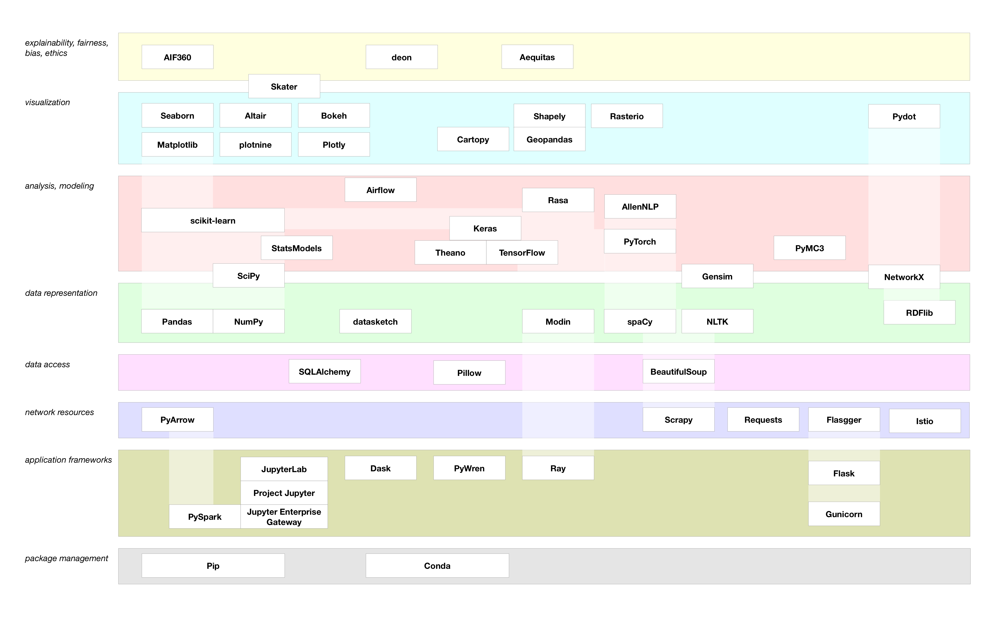

# Development

* Programming paradigms
  * [Goodbye, Object Oriented Programming](https://medium.com/@cscalfani/goodbye-object-oriented-programming-a59cda4c0e53) - That lecture helps to jolt away preconceived ideas that have been learned over the years OR simply point usual mistakes. Take a look.
* Code quality
  * [Code climate](https://codeclimate.com/quality/) - A lot of tools in the industry, give a try to this one.
* Tutorials
  * [GraphQL API with AWS and Use with React](https://scotch.io/tutorials/graphql-api-with-aws-and-use-with-react) - Setting a `graphql` API along with a react application on AWS and AWS Amplify.

## Software design and principles

### mono-repo vs multi-repo and microservices vs monolith

We have experienced both mono repo and multi repo along with microservices and monolith for years now. My conclusion regarding our context:

* It is hard to set a mono repository right,
* It is harder to manage hundreds of repository for several services,
* You have to build or use tools dedicated to mono repository management, and in particular for its continuous integration,
* A monorepo, compared to multi repo, still is way more efficient regarding deployment, coherence, bug tracking, cleaning and "community management,"
* Onboarding a new team member in a microservices architecture along with a mono repository is tedious,
* Onboarding a new team member in a microservices architecture along with multi repositories is tedious squared,
* Only documentation updated on a regular basis can compete with onboarding with a monolith,
* Microservices are impossible to debug by default, you must build the debugging capabilities,
* Microservices are way more efficient in term of flexibility, innovation possibilities, and creativity; overall it brings velocity,
* Continuous delivery setup is a journey. Keep the focus and priority: often it is delivering reliably new features to your customers.

Microservices set in a monorepo was the perfect combination for our team, its size, and our project.

Other sources, so you can have a better idea of the debate:

* [Advantages of monorepos](https://danluu.com/monorepo/) - "Conversation wrote down to avoid repeating things"
* [Confessions of Continuous Delivery Experts: From microservices back to monolith](https://www.gocd.org/2017/12/06/confessions-continuous-delivery-experts-snapci-microservices-monolith/) - Lesson learned moving from microservice to monolith.
* [Segment's transition back to a monorepo](https://changelog.com/podcast/312) and its original [blog post](https://segment.com/blog/goodbye-microservices/)

For the same context that was ours, what I might consent is to split application tiers into different repositories (example: front-end in one repository, back-end in another), that's all!

### Technical debt

> ["Technical Debt Is Like Tetris"](https://medium.com/s/story/technical-debt-is-like-tetris-168f64d8b700). You can't win. You can only control how quickly you lose.

Technical Debt is part of the engineering landscape of any developing business. And you create some technical debt with any arbitrage in favor of new feature against sanitation of any kind. The Tetris analogy is excellent in the sense that you can mark higher scores only when you accept technical debt, when you are aware of it and when you play with it. Then, every new feature is an opportunity to fix it, just like when you close several raws at once.

## Development environment

### iPad as main computer

* [iPad Pro for programming](https://jann.is/ipad-pro-for-programming/)
* Mosh (a "better" ssh):
  * [mobile-shell build instruction](https://github.com/mobile-shell/mosh/wiki/Build-Instructions)
  * [Setting mosh server on AWS](http://aws-labs.com/install-mosh/)
  * [Adding mosh support to your AWS servers](http://fuzzyblog.io/blog/aws/2017/07/02/adding-mosh-support-to-your-aws-servers.html)
  * [Mosh is available on AWS Linux](https://aws.amazon.com/amazon-linux-ami/2017.03-packages/)

A lot of people have tried, I tried, the last iteration of the iPad pro almost convinced me. For me, this is still not possible. It is fine to programm remotely with a AWS server but it is expensive, and doesn't cover all usages. What if you need to manipulate data from your iPad on your remote server? I need to programmaticaly access my data locally, that's all. I still need my "natural" terminal with data access.

In the process, I discovered mosh and that is a damned good solution for remote access to server. It misses a strong solution for ssh forwarding necessary in a bastion implementation.

### Mac OS X

Mac OS X on a MacBook is a wonderfull development environment. When we have been acquired by Airware, all our developers had to switch from a centralized development server to distributed development environment on Mac OS X. As we hadn't raised much, we were almost shocked by that sudden developer onboarding cost increase.

It enabled smoother meeting sessions, remote working and for some others it offered a real computer at home.

You can heavily personalize your setup, but there is only one real big issue when you unbox a Mac. It lakes a real package manager, but there is a solution for that: [homebrew](https://brew.sh).

I'll do nothing else in the future. My developers will have choice between a laptop Mac or Linux one. In any case a Linux/Unix base centralised development environment with a crypted harddrive.

#### Automation

In order to setup a brand new Mac from scratch I build a bootstraping script that:

* Install [Homebrew](https://brew.sh)
* Install [mas](https://github.com/mas-cli/mas), a Mac App Store command line utility
* Install xcode tools
* Install usefull packages (such as aws cli, htop, mosh, etc.)
* Setup [zsh](http://zsh.org/), [oh-my-zsh](https://github.com/robbyrussell/oh-my-zsh), [nerd-fonts](https://github.com/ryanoasis/nerd-fonts) and [iTerm2](https://www.iterm2.com/)
* Bind my [dotfiles](https://en.wikipedia.org/wiki/Hidden_file_and_hidden_directory) with my `$HOME` directory

You can find more details [here](https://github.com/hervenivon/dotfiles)

Some more complete example or tools are available out there:

* [strap](https://github.com/MikeMcQuaid/strap) - The so called "minimal" macOS development system bootstrap will give you way more than mine previously mentioned.
* [mac setup](https://sourabhbajaj.com/mac-setup/) - The reference guide for setting up a mac for development "manually". Source is available [here](https://github.com/sb2nov/mac-setup)

### Code editor

[`vscode`](https://code.visualstudio.com/) replaces the long 1st in my heart [`Sublime`](https://www.sublimetext.com/): it has proven to turn myself into a better "prototyper", data extractor and developer in the past year. It is reliable, able to handle large files, has a small memory footprint and perfectly extendable.

My mandatory extensions:

* [Settings Sync](https://marketplace.visualstudio.com/items?itemName=Shan.code-settings-sync) - You might spend a bunch of time configuring `vscode` (extensions, settings and keybindings). When you are changing your computer, you are happy being able to grasp all that configuration automatically. One extension to rule them all!.

Further awesomenesssss 🤩:

* [awesome-vscode](https://github.com/viatsko/awesome-vscode) - a extensive list of interesting resources for `vscode`.
* [code-server](https://github.com/codercom/code-server) - Executing vscode in webbrowser from your server!

### Command line enhancements

* [`fkill-cli`](https://github.com/sindresorhus/fkill-cli) - An interactive killing command, much nicer than your traditional way. Would love a native one not going through `node`.
* [`graphcurl`](https://github.com/hasura/graphqurl) - Turn your command line into a `curl` like tool for GraphQL, keeping the exploration taste of [graphiql](https://github.com/graphql/graphiql)
* [`jq`](https://stedolan.github.io/jq/) - Must have tool for any modern devOps or serious people working with a `Terminal` 😄 _(`json`)_
* [`rb`](https://github.com/thisredone/rb) - Extends your command line workflow with a fully loaded inline ruby interpreter. Just in case you are alergic to `awk` and `sed` _(`Ruby`)_
* [`terminalizer`](https://github.com/faressoft/terminalizer) - A way to record your `Terminal` and create gif images.
* [`tldr`](https://github.com/tldr-pages/tldr) - Ever wanted to get just what you need instead of verbose man pages?
* [`q`](https://github.com/harelba/q) - Run SQL queries directly on CSV files.
* [`up`](https://github.com/akavel/up) - Write pipe processing with instant live preview of command results.

### Docker

* [`dive`](https://github.com/wagoodman/dive) - Have you ever wanted to look into your `Dockerimage` result layers. Here you are!

### Security

* [gitleaks](https://github.com/zricethezav/gitleaks) - Waiting for github next move in the security landscape, here is a way for you to scan code source for unencrypted secrets. 👮‍♂️

## Agile

Tools:

* [DailyBot](https://dailybot.co/) - Helps remote teams to fill their daily scrum

## Languages

### `CSS`

CSS animations in [action](http://animista.net/play/background/color-change)

### `Javascript`

#### Animation

* [Three.js](https://github.com/mrdoob/three.js/) - 3D animation.
* [Anime.js](https://github.com/juliangarnier/anime) - CSS, DOM, SVG transform.
* [Mo.js](https://github.com/legomushroom/mojs) - Equivalent to anime.js. Another taste, you choose.
* [Vivus](https://github.com/maxwellito/vivus) - Focus on SVGs animation.
* [GreenSock](https://github.com/greensock/GreenSock-JS) - The swiss knife and Veteran of the pack.
* [Scrollreveal](https://github.com/jlmakes/scrollreveal) - Zero dependencies scrolling animation.

### `Nodejs`

#### npm

* [3 Tools to Keep npm Packages Updated](https://scotch.io/bar-talk/3-tools-to-keep-npm-packages-updated) - Keeping your package up to date is critical for security and stability. Use any mean to achieve it. Here the standard way, a VS Code extension and ncu are presented.

#### Building Command line

* [ervy](https://github.com/chunqiuyiyu/ervy) - Bringing charts to the terminal, because every project needs a command line and dataviz is fun!
* [qoa](https://github.com/klaussinani/qoa) - Minimal interactive command-line prompts with no dependencies.
* [ink](https://github.com/vadimdemedes/ink) - Building your command-line applications with React, Test your command-line applications with components.

#### Performance

If performance is key to your application, please spend time on testing and tweaking it.

You can use some great open source tools before jumping into the service or paying landscape like [autocannon](https://github.com/mcollina/autocannon) which simulates concurrent HTTP calls. The following [article](https://www.smashingmagazine.com/2018/06/nodejs-tools-techniques-performance-servers/) from Smash magazine will give you a very good entry point for perfomance analysis on node.js serveur projects.

### `Python`

Python comes with a lot of popular Python libraries and frameworks. The following diagram made by [Paco Nathan](https://community.ibm.com/community/user/datascience/people/paco-nathan) is a landscape diagram that introduces 50 of the most popular Python libs used in [data science](./data-science). It was introduced in ["A landscape diagram for Python data"](https://community.ibm.com/community/user/datascience/blogs/paco-nathan/2019/03/12/a-landscape-diagram-for-python-data). Definitely the place to go first if you are looking for something.

#### Performance

Performance (or lake of) drains a lot of attention in python. It is not a compiled language, and yes, it can be slow. Have a look to the following, some extra to enhance your beautiful python code.

* [From Python to Numpy](http://www.labri.fr/perso/nrougier/from-python-to-numpy/) - An online book that teaches how to migrate from standard `Python` to `Numpy` through vectorization.
* [7 Strategies for Optimizing Numerical Code](https://speakerdeck.com/jakevdp/seven-strategies-for-optimizing-numerical-code) - An overview of 7 technics to enhance `Python` performances.

#### Data-viz

* [Python Data Visualization landscape](https://www.anaconda.com/blog/developer-blog/python-data-visualization-2018-why-so-many-libraries) - An heavy loaded landscape of data visualization tools in python ready for convergence.
* [plot.ly](https://towardsdatascience.com/the-next-level-of-data-visualization-in-python-dd6e99039d5e) - Extensive zoom and discovery of `plotly` for `Python`.
* [Introduction to plotly express](https://medium.com/@plotlygraphs/introducing-plotly-express-808df010143d) - Introduction to the supercharged version of `plotly`. (see below)

Sometimes the everything is possible frameworks and libraries are too complicated and one just need a quick datavize:

* [Plotly Express](https://www.plotly.express/plotly_express/) supercharges [Plotly.py](https://plot.ly/python/)
* [Seaborn](https://seaborn.pydata.org/) supercharges [matplotlib](https://matplotlib.org/)

### `Ruby`

* Command line:

### `Bash`

* Command line:
  * [bash-boilerplate](https://github.com/alphabetum/bash-boilerplate) - Name speaks for itself. Even today, bash might be the best answer to a simple clear problem that needs a repetitive way to being reproduced. This repository kick-starts it even further.
  * [bash-oo-framework](https://github.com/niieani/bash-oo-framework) - If `bash-boilerplate` is not enough you should find everything you need here.

## Open Source

* [project-checklist](https://github.com/amilajack/project-checklist) - The project checklist when you want to share your creation with the world. An extensive list of actions to execution before the release.

Open source has been awesome for Redbird, Airware and Delair in many ways. First providing the necessary tools for processing GIS data, second providing an unlimited source of inspiration. Some trully inspiring open source projects.

* [Open Drone Map](https://www.opendronemap.org/)

## Technologies

### AWS

* Lambda Optimization:
  * [Lambda optimization tip – enable HTTP keep-alive](https://theburningmonk.com/2019/02/lambda-optimization-tip-enable-http-keep-alive/) - Drastically reduce average execution time of each lambda function working with a DB

### Serverless Examples

* [Dynamic image resizing with Node.js and the Serverless Framework](https://serverless.com/blog/dynamic-image-resizing-nodejs/) - Leverage AWS S3 events, API Gateway and Lambda to automatically resize images based on S3 requests.

### Web development

* [Lighthouse](https://developers.google.com/web/tools/lighthouse/) - Lighthous is an open source developer tool from Google that helps to audit web sites for performance, accessibility, and more. It is an extension to Chrome dev tools, a command line and a node module.
