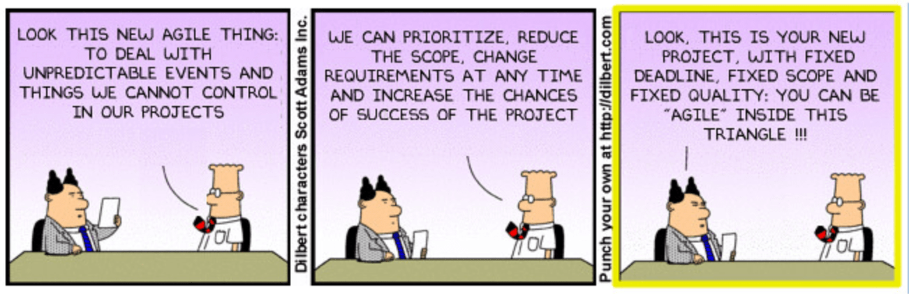
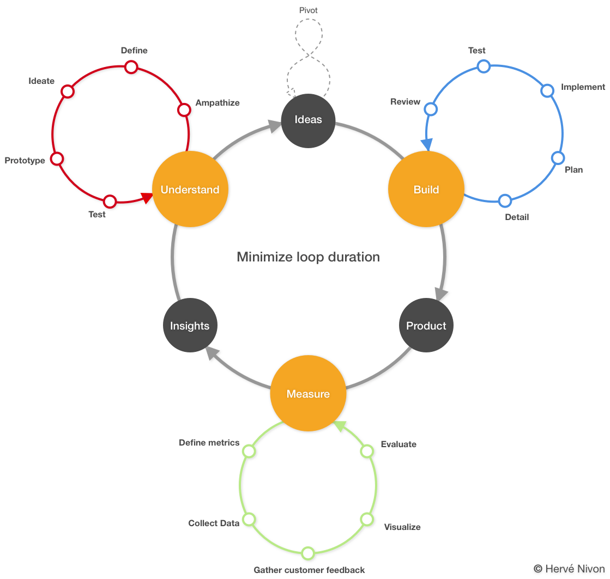

# Growing a company

This section covers what I think are the core principles of the ideal startup company to make it innovative and successful as much as possible. This is the sum of lessons I learned over time.

Focusing on the company itself or the product it builds, it provides inights and tools to focus on.

## Principles

The following paragraphs cover in details what I think are the most important principles to follow building your own company in our modern context:

1. [Widespread core values](#widespread-core-values)
1. [Be a leader](#be-a-leader)
1. [English first](#english-first)
1. [Document everything](#document-everything)
1. [Embrace change](#embrace-change)
1. [Default to Transparency](#default-to-transparency)
1. [Data driven](#data-driven)
1. [Security first](#security-first)
1. [Cloud only](#cloud-only)
1. [An API for everything](#an-api-for-everything)
1. [Failure is waiting for you](#failure-is-waiting-for-you)
1. [Automation is key](#automation-is-key)
1. [Be proud](#be-proud)

### Widespread core values

You should have clear and widespread core values. It is not enough to keep them for you, these core values should be known from everyone and should be part of all your interviews and you must ask each interviewed people how do they feel about them.

### Be a leader

There is a litany of management styles in the litterature (Autocratic, Persuasive, Laissez-faire, Consultative, etc.). The past 15 years of management proved to myself that a good manager doesn't fit in one and only box. Furthermore your management style is really personnal and may vary overtime or depending of the people you interact with. It is all about Human relations.

I think that I adapt myself to my interlocutor and the situation. I might be persuasive, consultative, or laissez-faire, but inin all cases I invest a lot of my time in the relationships I'm building.

To my mind, there is only one rule of thumb, your collaborators will prefere working with a leader than with a boss!

### English first

Everything must be written in English. And for us, French people, it is unfortunate, but bad English is still better than French. You should at least write all of your documentation in English. This is the bare minimum.

Some key reasons gathered from the [FAQ](https://www.grammarly.com/faq) page of [Grammarly](https://www.grammarly.com/) a tool I use every day to enhance my English skills and quality:

> * One quarter of the world’s population speaks at least some English.
> * More than one billion people are studying English worldwide.
> * 80 percent of computer data is processed and stored in English.
> * Most satellite transmissions are carried in English.
> * More than half of the world’s newspapers are published in English.

### Document everything

Every piece of your work, from idea to real life architecture, should be documented.

### Embrace change

What you have in mind will never be in place, the secret is to adapt yourself, your strategy, your vision, your plan and everything in order to keep your project healthy. You must be agile and [don't just pretend to be](https://www.flickr.com/photos/lucaminudel/6059269914/).

### Default to Transparency

When Buffer introduced [Open Salaries](https://open.buffer.com/introducing-open-salaries-at-buffer-including-our-transparent-formula-and-all-individual-salaries/) they shared their second core value: "Default to Transparency". Back in 2013, I was working in one of the 5 biggest consulting company in the world, it inspired me a lot. At Redbird, then Airware and Delair, in hindsight, I can say that as a company we haven't always been transparent. In my next startup I will do as much as I can to embrace that principle, as strong as possible from internal email with open CC to personal shared self-improvement through open progress report. And, even if it is hard for my French culture 🐔🇫🇷🥖, up to Open Salaries!

Open your meetings, let interested people to come in as flies on the wall. Ask for candide feedback at the end of it.

What do you need to take a good decision? Personnaly, I require as much information as possible, I need a full context and I need to understand the whole situation which is often the case behing a CTO or a VP of engineering. But, if you expect your team to take the smartest decision possible, they will need the same level of information than you.

> "lots of traditional, widely accepted, and perfectly legal business practices just can’t be trusted by customers, and will soon become extinct, driven to dust by rising levels of transparency, increasing consumer demand for fair treatment, and competitive pressure" - Don Peppers and Martha Rogers in [Extreme Trust: Honesty as a Competitive Advantage](https://amzn.to/2Cg0BYz)

Transparency will help more than it will harm. Transparency builds and strengthens trust in your team and with your customers.

[Why we made our product roadmap public (and how to build your own)](https://frontapp.com/blog/2015/04/02/why-we-made-our-roadmap-public-and-how-to-build-your-own/) - Front application explain why they made their roadmap public. It still is the case. Personnaly, I trully believe, that secrecy doesn't help any company to expand, its capabality to execute better, and faster is. In short: users like that you share tour vision, product gets better even faster because of direct feedback, team accountability. Some public roadmaps:

* [Trello](https://trello.com/b/nC8QJJoZ/trello-development-roadmap)
* [Front](https://trello.com/b/kZsVVrc8/front-product-roadmap)
* [KanbanMail](https://www.notion.so/Public-Roadmap-7adabe84ea7a47588f4b5e8fa9e5dde8)
* [notion](https://www.notion.so/What-s-New-157765353f2c4705bd45474e5ba8b46c)

### Data driven

Think of your product in terms of data, gather every piece of data you can, measure, track and manage it, put it in your contracts and terms of services:

* It will be easier to determine the next iterations of your product (what features are used, how long did it take to load the page, what is the require accuracy)
* You will better serve your customers
* Data enables Machine Learning, the only mean actualy.

### Security first

Security should be at the root of every technical, product or strategy choice. Your customers are your value. You will have to gain your customers’ trust, and you should do everything you can to keep it.

For any service, you should avoid to build your own authentication system and you must enable [SSO](https://en.wikipedia.org/wiki/Single_sign-on) as soon as possible. One password to rule them all is key to most B2B deals.

There are always ways to enhance your security. Beware, the system’s security your building should never slow down your people otherwise they will find a workaround. Everyone in the company should embrace it and support it. (Another question for your future recruitments).

[GDPR](https://eugdpr.org/) is here to help anyway 🚨.

Open source in the recent years helpes accelerate development of new projects, in the mean time, it has been a way to spread vulnerabilities in the most efficient way ever. To understand how open source can arm any project read ["I'm harvesting credit card numbers and passwords from your site. Here's how."](https://hackernoon.com/im-harvesting-credit-card-numbers-and-passwords-from-your-site-here-s-how-9a8cb347c5b5).

GitHub is providing more and more services ([token scanning](https://github.blog/2018-10-17-behind-the-scenes-of-github-token-scanning/), [security alerts](https://github.blog/2018-10-09-applying-machine-intelligence-to-security-alerts/), [bug bounty program](https://bounty.github.com/index.html#open-bounties)) to secure your repositories. That is great, but depending on your project you'll need further security, you might be asked to track your opensource depencies. Sooner than later, it will happen. There are a lot of tool in the wild. Here is where to start:

* [Fossa](https://fossa.io/)
* [Dependency Track](https://dependencytrack.org/)

You must be careful at any stage. I often share a story with my new hires about an intern that had to pay more than $8000 because of pushing AWS secret keys on one of his public repository. [`gitleaks`](https://github.com/zricethezav/gitleaks) will help you to ensure that in a CI/CD pipeline.

When you are dealing with large enterprises you are asked to prove the security level of your company. The security of devices used by your employees is part of the equation. Tools such as [Jamf](https://www.jamf.com/products/jamf-pro/) will help you manage and protect all Apple devices from anywhere.

### Cloud only

Everything must be in the cloud, nothing should ever take a way into your IT office, not a single server should ever exist into that cabinet. The only thing you should ever need is a VERY good internet connection. Every tool you’re about to use should be a service otherwise drawbacks are licensing nightmares and or on-site server maintenance. The other advantage of hosting everything in the cloud is to accelerate really strong, really quick.

If it ever happens to install a server, you will always need someone to maintain it, and it will be really hard to get rid of it.

Priority is your business, and all the time you spend should go into customer value creation. As a startup, you cannot aford reinventing the weel or speding money to build things than others do better than you.

### An API for everything

Every development you make should be served through an API. This is a necessary mean to enable growth and make it sustainable for your project and your teams.

> "All service interfaces, without exception, must be designed from the ground up to be externalizable. That is to say, the team must plan and design to be able to expose the interface to developers in the outside world. No exceptions. Anyone who doesn’t do this will be fired.  Thank you; have a nice day!" - Jeff Bezos CEO of Amazon

### Failure is waiting for you

Design with failure in mind. Failure is the first event you'll met in any project. What you will have at the end is likely to be more complex than what you desire. You have to embrace that fact, it is going to happen.

> "Everything fails, all the time" - Werner Vogels, CTO of Amazon

Some companies are even playing with their production environment. Netflix's [Chaosmonkey](https://github.com/Netflix/chaosmonkey) randomly terminates computing unites that run inside of a production environment exposing engineers to failures by design. It inherently incentivizes them to build resilient services.

### Automation is key

Automation is the key to successfull development teams. And, it should come in the early stages on your internal tooling or your production workloads. Automation will save you time and money all along your journey

Tooling your developers is mandatory, and it you should let them be free (help them to have a good development environment. Enable your developers and keep the evolution process of the tooling easy. Let them propose, enhance it and share their creation with the rest of your team.

### Be proud

Overall, assume your choices, justify them, and proudly defend them. This is not because you are not using the last trendy single page application framework that your code base is crap or a spaghetti mess. Your startup will always have a history, you must be proud of it and all the lessons learned along the way.

## Methodology

They are many different problem solving and optimization approaches or methodologies - most coming with certifications... - that when you start digging you might found yourself lost in the various terms and abbreviations: [design thinking](https://en.wikipedia.org/wiki/Design_thinking), [lean enterprise](https://en.wikipedia.org/wiki/Lean_enterprise), [lean startup](https://en.wikipedia.org/wiki/Lean_startup), [six sigma](https://en.wikipedia.org/wiki/Six_Sigma), [lean six sigma](https://en.wikipedia.org/wiki/Lean_Six_Sigma), DMAIC, DMADV, 5 whys, etc.

While some are coming from industrial production improvement with the idea of reducing waste, and others are synthesis from famous entrepreneurs, they are all directed toward better serving customers. In the end, they provide an incredible toolbelt that you can leverage to enhance your process, better design your product and becoming a profitable company. I see here an abundant source of tools and techniques to solve issues and organize yourself and your company.

### The company loop

Redbird provided a data management platform using imagery acquired by drones to generate actionable insights and business decisions for various verticals. When I was the CTO of Redbird, on top of building the platform, we started partnership discussions with large companies in some of the industries we were serving: mines and quarries first. The idea was to develop a joint product: they will provide the data (tire, trucks, blast, sensor), we will aggregate and enhance them along with the data we were already producing from drone imagery.

These partnerships forced us to organize our startup as being the most efficient possible:

1. We needed to appear serious to our interlocutors,
1. We urge to keep our startup agility,
1. Our budget was short and our need for creativity colossal.

The most frugal and efficient methodology I knew was "lean startup." This methodology was our starting point. Coming from a consulting company in which I had to work with the fortune 500 for typical two years projects or in the innovation group to build new offering I was lucky enough to enrich our experience with a set of other techniques and methodologies: design thinking, UX Design, six sigma, scrum.

I was genuinely convinced that being transparent on the way we worked - one iteration after the other, with failure being part of the process, a continuous feedback loop to enrich the iterative development approach and to continuously improve, encourage criticism and learn from it - will turn these initiatives into a success.

Our partners trusted us. As a conclusion, we built several products we sold from machine efficiency geolocalized to blasting history and quality measurement becoming a digital twin of our customers' physical world.

The following illustration represents my ideal methodology to grow a company and a product in a fast innovative and competitive environment (Design Thinking + Lean Startup + Scrum + Experience): the company loop.

While "Ideas" may be the starting point of the loop, I advise starting from insights which often are a pain point.

* **Comprehend**: the actions which lead to ***ideas*** from ***insights***
  * **Empathize**: What is the true problem? Do your homework and prepare yourself to be in your customers' shoes.
  * **Define**: How do my customers fill the issue? Use customers' interviews, feedback, and observation to define the customers' point of view.
  * **Ideate**: What are the craziest and most creative ideas you can come with? It is time to generate a flow of possibilities.
  * **Prototype**: How those ideas can operate? Put yourself at work and experiment. Rough sketches will do the job.
  * **Test**: What is the reaction against the prototype(s)? Does it work? Conduct workshop, test internally, play roles, act.
  * **Deliverables**:
    * Actionable ideas
    * Personas
    * Mood boards
    * User journeys
    * User flows
    * Wireframes
* **Build**: the actions that transform ***ideas*** into a ***product***
  * **Detail**: What do these ideas mean from a technical standpoint? Detail as much as possible. Use features, epics and user stories.
  * **Plan**: How do we organize the work? What are the priorities?
  * **Implement**: Time to make things real! Build, code, implement, iterate. Use open source, do not reinvent the wheel, leverage the cloud and its service. Focus on your core business and added value.
  * **Test**: Are your product working accordingly with your ideas? Unit tests, integration tests, usability tests.
  * **Review**: Time to learn from the development cycle to do a better iteration next.
  * **Deliverables**:
    * Continuous delivery of the product in an incremental fashion
* **Measure**: the actions that dissect ***product*** usage into ***insights***
  * **Define metrics**: What is relevant for your product? Churn, number of unique daily visit? Time spent on the platform? Tool duration usage? What are the relevant events?
  * **Collect data**: Continuously measure your defined metrics. Data will come from your product. Conduct
  * **Gather customers feedback**: Prepare the comprehension phase, gather your customers' feedback, observe them. Provide different versions of the application and measure reaction differences.
  * **Visualize**: Put your data at work, spreadsheets are not enough. Assemble your measures in something meaningful to everyone. Leverage real-time analytics, alerting and monitoring.
  * **Evaluate**: What does these numbers and chart significate? Determine the quality of your data, judge the significance and how much it worths. Assess and select.
  * **Deliverables**:
    * Product heatmap
    * Cohort analysis
    * Funnel analysis
    * Dashboard
    * Geographic repartition
    * Technical environment
    * Pain points
    * Interviews

The overall idea is to mininize the whole cycle duration to achieve a better time to market for your product: build fast, fail fast. Each feature and your product must be tought and developed as a minimum viable product (MVP). Only build the strict minimum, avoid any waste, chase them, take as many shortcuts as possible, avoid reinventing the wheel. You will enrich it incrementally, one small step at a time with the validation of your customers every time.

A pivot is a shift in your business strategy in order to test and potentially validate a new approach regarding your initial product or business model. It typically happens from the comprehension of the product's insight and customer feedback.

Another virtue of this cycle: a strict implementation will lead to a better market fit.

For here on, the paragraphs further list and detail methods or tools that have proven useful to me.

### 8 types of waste

Lean Six Sigma principles focus on eliminating eight varieties of waste (you will often read Muda). They form the acronym DOWNTIME. The following paragraph describes them applied to software development.

* Defects

Defects are errors that require additional time, resources (, and money) to fix. In a traditional manufacturing process, it can be a defective part that must be remade. In software development, it is certainly the easiest waste variety to understand in the list. Bugs and software development are going hand in hand since [1947](https://en.wikipedia.org/wiki/Software_bug). But, to my mind, defects in software development don't only appear in final the code they can occur all along the process from the software design to the poorly annotated data in machine learning.

* Overproduction

Overproduction is production ahead of demand. Ex: too many goods are produced and waiting to be sold at the warehouse. In software development, it means developing the wrong feature, either because it is badly designed or because it doesn't match any requirement and is therefore not used.

* Waiting

Waiting is the delay between steps in production. Ex: when the next person in line is overwhelmed, you must wait. In software development, it can happen in several places: when developers are waiting for a change request approval, when they are waiting for functional clarification, when they wait for builds in the CI.

* Not-Utilized Talent

In small businesses, the team is often the most critical asset; not and underutilized talents, skills, and knowledge can have a pernicious, negative and sometimes destructive effect on an organization. In small businesses and in startups in particular, people join you because they believe they can have a true impact which is way harder to achieve in big corporations. Recognizing their energy, nurturing them will provide great benefits. You must trust your team and leverage it as much as you can, and this is why you always must seek and be attentive to feedback. Wrong task assignment, lack of training, lack of teamwork, secrecy or poor communication are some evidence of not and underutilized talents.

* Transportation

Transportation waste is the movement of materials and goods that are not required to perform the processing. Ex: when you need to move a piece to another plant area because of a poorly desing arrangement. It can be because of too many steps, miss designed workflows. In software development, we are speaking of information transportation which might seem seamless. Nevertheless, it can happen: when your customer feedback is going through too many steps before becoming actual lines of code, when you have to switch tasks continuously or when you have to duplicate data to perform machine learning training locally.

* Inventory

Inventory waste is all produced parts and material that have been purchased and are waiting to be used. It also includes work-in-process, everything that is not yet ready for shipment or sale. In software development, I mainly see it as non-deployed software which can be due to too long development cycles or finished software not validated and waiting for prime time

* Motion

Motion waste refers to any movement one has to do to accomplish his task for one employee, between employees, for a machine. In software development, we can see it as the necessary hand-offs between different jobs. Beyond the material conditions, such as the quality of the workspace highlighted in the industry, motion waste can be seen as the knowledge which is lost each time a deliverable is handed off between 2 employees to finish a task.

* Extra-Processing

Extra-processing waste is deduced from processes that require multiple versions of the same task, poorly defined processes or task with low value added. Examples: Excessive reports, data duplications, lack of standards. In software development, some working with agile methodologies argues that even estimating development time is a waste; this is the [#NoEstimates](https://twitter.com/search?q=%23noestimates) movement.

These eight varieties of waste are inspired by the [Toyota Production System](https://en.wikipedia.org/wiki/Toyota_Production_System). You can learn more about their definition and some other examples [here](https://www.processexcellencenetwork.com/business-transformation/articles/the-8-deadly-lean-wastes-downtime), [here](https://www.solutionsiq.com/resource/blog-post/waste-in-software-development/), and [here](https://www.solutionsiq.com/resource/blog-post/more-waste-in-software-development/).

### DMAIC & DMADV

DMAIC used for projects aiming at improving an existing business process and DMADV used for projects aiming at creating new product or process designs are two 5 steps methodologies coming from Six Sigma.

What is interesting is the actions these methodologies trigger.

#### DMAIC

* Define the project goals from the voice of the customer and their requirements
* Measure key aspects of the current process, collect relevant data and calculate the 'as-is' process capability
* Analyze your measures to determine cause-and-effect relationships. Verify all factors have been considered. Get to the root cause of the problems you are looking at
* Improve the current process. Set up a pilot to establish process capability
* Control the new process to ensure that it can achieve the objective. If there is a deviation, repeat the process.

#### DMADV

* Define the goals that are consistent with customer requirements and demands according to your strategy
* Measure criteria which are crucial to your new product or process
* Analyze your findings to identify alternatives
* Design an improve these alternatives
* Verify these alternatives, set up a pilot, implement the process or product.

### Value-stream mapping (VSM)

In short, value-stream mapping is a technique that helps to determine and distinguish valuable activities from wasted time and value in a production flow of material and information that is executed to bring products to customers.

VSM uses a set of predetermined symbols to map your process in an intelligible way.

VSM can be used to improve any process where there are repeatable steps, and handoffs. In software development, you can make an analogy with continuous delivery.

Learn more on [wikipedia](Value-stream mapping) or watching ["How to read a value stream map?"](https://vimeo.com/23684934) video.

### Interviews

* Use the [STAR](https://en.wikipedia.org/wiki/Situation,_task,_action,_result) technique to conduct your interviews: **S**ituation, **T**ask, **A**ction, **R**esult. This will help you gathering all relevant information and help interviewed people being complete.
* Set your objectives and review objectives of other with [SMART](https://en.wikipedia.org/wiki/SMART_criteria) Goals only: **S**pecific, **M**easurable, **A**chievable, **R**ealistic, **T**ime-related

## Product management

### Designing Successful Products

From [Hugh Dubberly](http://www.dubberly.com/topics/design/successful-product.html), the Venn diagram that depict what makes a successful product:

1. Desirability
1. Technology
1. Sustainability

An that framework applied to three tech giants:

### The minimum rodmap

The minimum features of a product which is target to length years are the following:

Step 1: setup of your delivery toolchain

* Monorepo and its development tools
* Continuous Deployment
* Continuous Delivery
* The MVP

Step 2: core functions

* Single Sign On (SSO)
* API first (strongly separation of Front-end and Back-end)
* Security at all stages (encryption at REST and in Transit)
* Usage tracking

### Tools

* [airfocus](https://airfocus.io) - Some interesting view to render your roadmap.
* [trello](http://trello.com/) - The famous Kanban based online service to manage your task and roadmap.
* [notion.so](https://www.notion.so) - The one tool for all replacing evernote, trello, asana, etc.
* [uservoice](https://www.uservoice.com/) - User centric roadmap definition.

In any case, please avoid using [aha!](https://www.aha.io/). This is certainly unfair, but my experience with this tool, and the support team is dramatic. aha! was hated in our company. It's code name was "the place were ideas die". It was slow, hard to use, nearly impossible to find information. And, at the end we weren't able to export our data. Cherry on the cake: way too expensive.

### Features, epics, user stories

* [Engineering guide to writing correct User Stories](https://sobolevn.me/2019/02/engineering-guide-to-user-stories)

## Working Remotely

The cost of living is increasing so much in so many places that it is not a risk anymore; it is an issue for most of us. Our world is rapidly changing, and one thing is for sure, we will see more and more all-remote workforces rather than the contrary.

Also, talents are all around the world, not only close to the place you are physically located. In the fast pace economy, it is crucial to get the right skills at the right time.

Being able to handle and support remote workforces - either they are partial or 100% - is key to any modern company. From the new generation's habits to the cost of living in world capitals, this is becoming a mandatory capability.

The following paragraph assembles my findings on that topic.

* [Remote: Office Not Required](https://amzn.to/2UAYe9N) - A mandatory reading on that topic.
* [Remote only](https://www.remoteonly.org/) - A commonity driven state of best practices

> "We are designers, engineers, and communicators united by a common goal, not a common location." - [Doist](https://doist.com/)

### Manifesto & handbooks

* [GitLab handbook](https://about.gitlab.com/handbook/) and [GitLab Remote Manifesto](https://about.gitlab.com/2015/04/08/the-remote-manifesto/)
* [Google Distributed Work Playbooks](http://services.google.com/fh/files/blogs/distributedworkplaybooks.pdf) - The result of remote work experience from Google.
* [Innolitics](https://innolitics.com/about/handbook/) - The innolitics handbook.
* [Open blog at Buffer](https://open.buffer.com/) - The whole open blog of the Buffer company appears as their manifesto to me.
* [Perks and benefits](https://open.buffer.com/benefits-remote-company/) - How does Buffer provide team benefits as a remote and international company?

### Testimonials

* [All-remote workforce](https://www.businessinsider.fr/us/gitlab-zapier-remote-emsisoft-invision-workforce-2019-1) - A series of pros and cons from all-remote companies like Zapier and GitLab. Some ideas to gather, some lessons to learn or confirm you're not alone. Some are applicable to global companies.
* [Elastic: how does a 250 people team work 100% remote](https://www.youtube.com/watch?v=rrlPhedNjbA)
* [State of remote Work 2019](https://buffer.com/state-of-remote-work-2019) - The latest installment of being a remote company: benefits and struggles of working remotely
* [The Joys and Benefits of Working as a Distributed Team](https://open.buffer.com/distributed-team-benefits/) - How does they make it work at Buffer?
* [Working together when we’re not together](https://blog.google/inside-google/working-google/working-together-when-were-not-together/) - With 100,000 "Googlers" across 150 cities in more than 50 countries, Google asked +5,000 employees about remote work. This is what they learned. Extract, 3 top tips: "Get to know each other as people", "Set [clear and diclosed] boundaries", and "Forge in-person and virtual connections"
* [doist blog](https://doist.com/blog/category/remote-work/) - The doist remote work publications
* [how they make it work](https://open.buffer.com/buffer-distributed-team-how-we-work/) - As part of the open culture of buffer, they share their way of working along with nice cards and pictures of some employees workspace
* [no office](https://open.buffer.com/no-office/) - The reasons why Buffer moved from on site to remote.

### Lists of companies

* [established-remote](https://github.com/yanirs/established-remote) - A list of remote companies
* [Remoteok](https://remoteok.io/remote-companies) - This is a remote dedicated job post index.
* [We Work Remotely](https://weworkremotely.com/) - Another remote dedicated job post index.
* [Remote only](https://www.remoteonly.org/) - In addition to the tips, the pros and cons, you'll find another list of remote companies.
* [25+ Fully Remote Companies That Let You Work From Anywhere](https://zapier.com/blog/companies-hiring-remote-workers/) - A review of famous remote ok companies.

## Further inspiration

* [Can you bootstrap a startup on the side?](https://justinjackson.ca/bootstrap-side-project) - Build you own path based on your experience, will and target.
* [40+ Startup Jargon Words You Need To Know To Raise Money](https://www.forbes.com/sites/kateharrison/2014/08/29/40-start-up-jargon-words-you-need-to-know-to-raise-money/)
* [This is hard](https://justinjackson.ca/hard) - Never forget that stopping your project is the main reason for failure
* [10 Lessons from 10 Years of Amazon Web Services](https://www.allthingsdistributed.com/2016/03/10-lessons-from-10-years-of-aws.html) - Simple rules, carefuly understand them.
* [The Inevitable Future: Startup Transparency](https://medium.com/swlh/the-inevitable-future-startup-transparency-3c5e92fcd96b) -
* The management world
  * [Most leaders don't even know the game they are in](https://www.youtube.com/watch?v=RyTQ5-SQYTo)
  * [Simon Sinek on Millennials in the Workplace](https://www.youtube.com/watch?v=hER0Qp6QJNU) - A shorter version focusing on Millennials.
* Boss vs leader
  * [10 Huge Differences Between A Boss And A Leader](https://www.lifehack.org/287785/10-differences-between-boss-and-real-leader)
  * [The Difference Between A Great Leader And A Regular Manager](https://www.lifehack.org/articles/work/the-difference-between-great-leader-and-regular-manager.html)
* [The Secret to Amazon's Success--Internal APIs](https://apievangelist.com/2012/01/12/the-secret-to-amazons-success-internal-apis/) - Futher insights on the Amazon API strategy.
