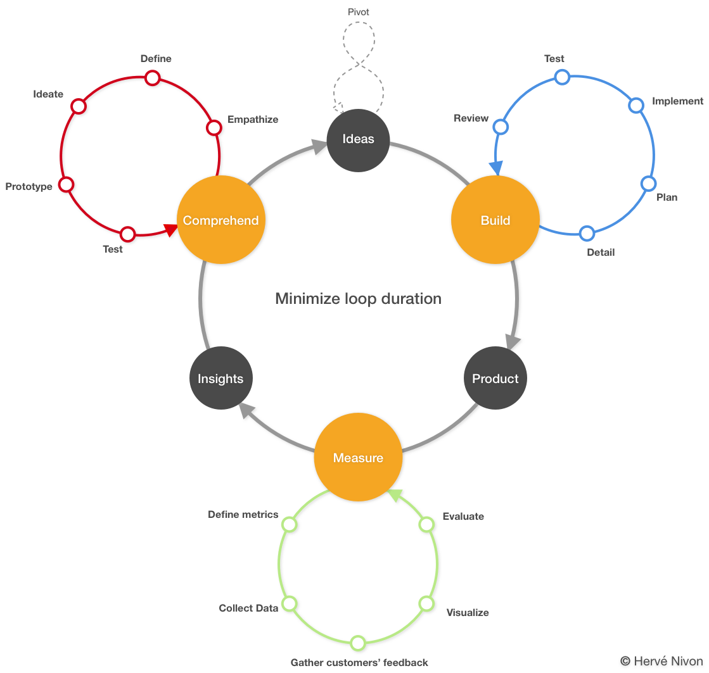
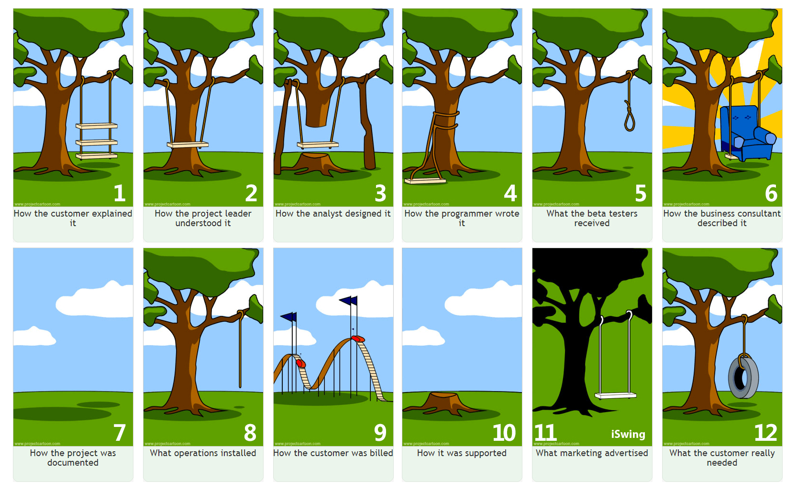

# Methodology

They are many different problem solving and optimization approaches or methodologies - most coming with certifications... - that when you start digging you might found yourself lost in the various terms and abbreviations: [design thinking](https://en.wikipedia.org/wiki/Design_thinking), [lean enterprise](https://en.wikipedia.org/wiki/Lean_enterprise), [lean startup](https://en.wikipedia.org/wiki/Lean_startup), [six sigma](https://en.wikipedia.org/wiki/Six_Sigma), [lean six sigma](https://en.wikipedia.org/wiki/Lean_Six_Sigma), DMAIC, DMADV, 5 whys, etc.

While some are coming from industrial production improvement with the idea of reducing waste, and others are synthesis from famous entrepreneurs, they are all directed toward better serving customers. In the end, they provide an incredible tool belt that you can leverage to enhance your process, better design your product and becoming a profitable company. I see here an abundant source of tools and techniques to solve issues and organize yourself and your company.

## The company loop

Redbird provided a data management platform using imagery acquired by drones to generate actionable insights and business decisions for various verticals. When I was the CTO of Redbird, on top of building the platform, we started partnership discussions with large companies in some of the industries we were serving: mines and quarries first. The idea was to develop a joint product: they will provide the data (tire, trucks, blast, sensor), we will aggregate and enhance them along with the data we were already producing from drone imagery.

These partnerships forced us to organize our startup as being the most efficient possible:

1. We needed to appear serious to our interlocutors,
1. We urge to keep our startup agility,
1. Our budget was short and our need for creativity colossal.

The most frugal and efficient methodology I knew was "lean startup." This methodology was our starting point. Coming from a consulting company in which I had to work with the fortune 500 for typical two years projects or in the innovation group to build new offering I was lucky enough to enrich our experience with a set of other techniques and methodologies: design thinking, UX Design, six sigma, scrum.

I was genuinely convinced that being transparent on the way we worked - one iteration after the other, with failure being part of the process, a continuous feedback loop to enrich the iterative development approach and to continuously improve, encourage criticism and learn from it - will turn these initiatives into a success.

Our partners trusted us. As a conclusion, we built several products we sold from machine efficiency geolocalized to blasting history and quality measurement becoming a digital twin of our customers' physical world.

The following illustration represents my ideal methodology to grow a company and a product in a fast innovative and competitive environment (Design Thinking + Lean Startup + Scrum + Experience): the company loop.

While "Ideas" may be the starting point of the loop, I advise starting from insights which often are a pain point.

* **Comprehend**: the actions which lead to ***ideas*** from ***insights***
  * **Empathize**: What is the true problem? Do your homework and prepare yourself to be in your customers' shoes.
  * **Define**: How do my customers fill the issue? Use customers' interviews, feedback, and observation to define the customers' point of view.
  * **Ideate**: What are the craziest and most creative ideas you can come with? It is time to generate a flow of possibilities.
  * **Prototype**: How those ideas can operate? Put yourself at work and experiment. Rough sketches will do the job.
  * **Test**: What is the reaction against the prototype(s)? Does it work? Conduct workshop, test internally, play roles, act.
  * **Deliverables**:
    * Actionable ideas
    * Personas
    * Mood boards
    * User journeys
    * User flows
    * Wireframes
* **Build**: the actions that transform ***ideas*** into a ***product***
  * **Detail**: What do these ideas mean from a technical standpoint? Detail as much as possible. Use features, epics and user stories.
  * **Plan**: How do we organize the work? What are the priorities?
  * **Implement**: Time to make things real! Build, code, implement, iterate. Use open source, do not reinvent the wheel, leverage the cloud and its service. Focus on your core business and added value.
  * **Test**: Are your product working accordingly with your ideas? Unit tests, integration tests, usability tests.
  * **Review**: Time to learn from the development cycle to do a better iteration next.
  * **Deliverables**:
    * Continuous delivery of the product in an incremental fashion
* **Measure**: the actions that dissect ***product*** usage into ***insights***
  * **Define metrics**: What is relevant for your product? Churn, number of unique daily visit? Time spent on the platform? Tool duration usage? What are the relevant events?
  * **Collect data**: Continuously measure your defined metrics. Data will come from your product. Conduct
  * **Gather customers feedback**: Prepare the comprehension phase, gather your customers' feedback, listen to them, observe them. Provide different versions of the application and measure reaction differences.
  * **Visualize**: Put your data at work, spreadsheets are not enough. Assemble your measures in something meaningful to everyone. Leverage real-time analytics, alerting and monitoring.
  * **Evaluate**: What does these numbers and chart significate? Determine the quality of your data, judge the significance and how much it worths. Assess and select.
  * **Deliverables**:
    * Product heatmap
    * Cohort analysis
    * Funnel analysis
    * Dashboard
    * Geographic repartition
    * Technical environment
    * Pain points
    * Interviews

The overall idea is to minimize the whole cycle duration to achieve a better time to market for your product: build fast, fail fast. Each feature and your product must be thought and developed as a minimum viable product (MVP). Only build the strict minimum, avoid any waste, chase them, take as many shortcuts as possible, avoid reinventing the wheel. You will enrich it incrementally, one small step at a time with the validation of your customers every time.

A pivot is a shift in your business strategy in order to test and potentially validate a new approach regarding your initial product or business model. It typically happens from the comprehension of the product's insight and customer feedback.

Another virtue of this cycle: a strict implementation will lead to a better market fit.

When I think about the sentence "What the customer really wanted", here is the drawing which comes to my mind first. [How Projects Really Work?](http://www.projectcartoon.com/). It has been circulating for years with several variations and additions. My preferred version:

From here on, the paragraphs further list and detail methods or tools that have proven useful to me.

## 8 types of waste

Lean Six Sigma principles focus on eliminating eight varieties of waste (you will often read Muda). They form the acronym DOWNTIME. The following paragraph describes them applied to software development.

* Defects

Defects are errors that require additional time, resources (, and money) to fix. In a traditional manufacturing process, it can be a defective part that must be remade. In software development, it is certainly the easiest waste variety to understand in the list. Bugs and software development are going hand in hand since [1947](https://en.wikipedia.org/wiki/Software_bug). But, to my mind, defects in software development don't only appear in final the code they can occur all along the process from the software design to the poorly annotated data in machine learning.

* Overproduction

Overproduction is production ahead of demand. Ex: too many goods are produced and waiting to be sold at the warehouse. In software development, it means developing the wrong feature, either because it is badly designed or because it doesn't match any requirement and is therefore not used.

* Waiting

Waiting is the delay between steps in production. Ex: when the next person in line is overwhelmed, you must wait. In software development, it can happen in several places: when developers are waiting for a change request approval, when they are waiting for functional clarification, when they wait for builds in the CI.

* Not-Utilized Talent

In small businesses, the team is often the most critical asset; not and underutilized talents, skills, and knowledge can have a pernicious, negative and sometimes destructive effect on an organization. In small businesses and in startups in particular, people join you because they believe they can have a true impact which is way harder to achieve in big corporations. Recognizing their energy, nurturing them will provide great benefits. You must trust your team and leverage it as much as you can, and this is why you always must seek and be attentive to feedback. Wrong task assignment, lack of training, lack of teamwork, secrecy or poor communication are some evidence of not and underutilized talents.

* Transportation

Transportation waste is the movement of materials and goods that are not required to perform the processing. Ex: when you need to move a piece to another plant area because of a poorly design arrangement. It can be because of too many steps, miss designed workflows. In software development, we are speaking of information transportation which might seem seamless. Nevertheless, it can happen: when your customer feedback is going through too many steps before becoming actual lines of code, when you have to switch tasks continuously or when you have to duplicate data to perform machine learning training locally.

* Inventory

Inventory waste is all produced parts and material that have been purchased and are waiting to be used. It also includes work-in-process, everything that is not yet ready for shipment or sale. In software development, I mainly see it as non-deployed software which can be due to too long development cycles or finished software not validated and waiting for prime time

* Motion

Motion waste refers to any movement one has to do to accomplish his task for one employee, between employees, for a machine. In software development, we can see it as the necessary hand-offs between different jobs. Beyond the material conditions, such as the quality of the workspace highlighted in the industry, motion waste can be seen as the knowledge which is lost each time a deliverable is handed off between 2 employees to finish a task.

* Extra-Processing

Extra-processing waste is deduced from processes that require multiple versions of the same task, poorly defined processes or task with low value added. Examples: Excessive reports, data duplications, lack of standards. In software development, some working with agile methodologies argues that even estimating development time is a waste; this is the [#NoEstimates](https://twitter.com/search?q=%23noestimates) movement.

These eight varieties of waste are inspired by the [Toyota Production System](https://en.wikipedia.org/wiki/Toyota_Production_System). You can learn more about their definition and some other examples [here](https://www.processexcellencenetwork.com/business-transformation/articles/the-8-deadly-lean-wastes-downtime), [here](https://www.solutionsiq.com/resource/blog-post/waste-in-software-development/), and [here](https://www.solutionsiq.com/resource/blog-post/more-waste-in-software-development/).

## DMAIC & DMADV

DMAIC used for projects aiming at improving an existing business process and DMADV used for projects aiming at creating new product or process designs are two 5 steps methodologies coming from Six Sigma.

What is interesting is the actions these methodologies trigger.

### DMAIC

* Define the project goals from the voice of the customer and their requirements
* Measure key aspects of the current process, collect relevant data and calculate the 'as-is' process capability
* Analyze your measures to determine cause-and-effect relationships. Verify all factors have been considered. Get to the root cause of the problems you are looking at
* Improve the current process. Set up a pilot to establish process capability
* Control the new process to ensure that it can achieve the objective. If there is a deviation, repeat the process.

### DMADV

* Define the goals that are consistent with customer requirements and demands according to your strategy
* Measure criteria which are crucial to your new product or process
* Analyze your findings to identify alternatives
* Design an improve these alternatives
* Verify these alternatives, set up a pilot, implement the process or product.

## Value-stream mapping (VSM)

In short, value-stream mapping is a technique that helps to determine and distinguish valuable activities from wasted time and value in a production flow of material and information that is executed to bring products to customers.

VSM uses a set of predetermined symbols to map your process in an intelligible way.

VSM can be used to improve any process where there are repeatable steps, and handoffs. In software development, you can make an analogy with continuous delivery.

Learn more on [wikipedia](Value-stream mapping) or watching ["How to read a value stream map?"](https://vimeo.com/23684934) video.

## Interviews

* Use the [STAR](https://en.wikipedia.org/wiki/Situation,_task,_action,_result) technique to conduct your interviews: **S**ituation, **T**ask, **A**ction, **R**esult. This will help you gathering all relevant information and help interviewed people being complete.
* Set your objectives and review objectives of other with [SMART](https://en.wikipedia.org/wiki/SMART_criteria) Goals only: **S**pecific, **M**easurable, **A**chievable, **R**ealistic, **T**ime-related

## Virtues of Constraints

A common belief consists of thinking that creativity is proportional to freedom. In reality, an unlimited schedule with an unlimited budget will lead any project to a black hole. The fewer resources you have, the more it will push you to use your ingenuity and to achieve your goal.

### The decision fatigue

From our childhood education and the importance of being able to choose the right studies to the modern consumerist culture where you can craft the ultimate coffee exactly matching your taste, we are conditioned to worship choice.

But according to [researches](https://michaelhyatt.com/the-science-of-decision-fatigue) our mental resources are limited and are depleted with use; every decision we take is consuming that mental tank.

Kathy Sierra in [Building the Minimum Badass User](https://businessofsoftware.org/2013/02/kathy-sierra-building-the-minimum-badass-user-business-of-software-a-masterclass-in-thinking-about-software-product-development/) depicted Professor Baba Shiv experiment in which two groups were asked to memorize 2-digit and 7-digit numbers respectively. When they were ready, the two groups were offered a piece of cake. Those who faced the more mentally consuming task were significantly more likely to eat the cake.

> "This was unbelievable; it took them a long time to figure out what was happening because it seemed so bizarre. But what happened is willpower and focus and concentration and working on problem-solving are all coming from the same pool of cognitive resources. More significantly, it’s really a scarce resource that’s easily depleted."

It is not in the labs only; it also happens in real life: a [study](https://www.pnas.org/content/108/17/6889) demonstrated that extraneous factors exist in judicial decisions - it is not just about laws and facts. The research indicates that favorable rulings "drops gradually from ≈65% to nearly zero within each decision session and returns abruptly to ≈65% after a break."

The fact is that no matter how rational you are, you can't indefinitely be a great serial decision maker. Your pool of right daily decision is limited.

With constraints come fewer choices, with fewer options you benefit more mental fuel to be creative.

The article ["Proof That Constraints Can Actually Make You More Creative"](https://www.fastcompany.com/3027379/the-psychology-of-limitations-how-and-why-constraints-can-make-you-more-creative),  demonstrates with real-life stories how constraints can turn people into more creative being. My favorite is the surprisingly compelling six words story.

> "For sale: baby shoes, never worn" — [supposed](https://en.wikipedia.org/wiki/For_sale:_baby_shoes,_never_worn) Ernest Hemingway

### The constraints bounding box

There are four aspects you can tweak to harness the power of constraints and encourage creativity: a bounding box in which a team can bloom.

#### Language

Twitter is famous for its 140 characters limitation that [used to](https://www.theguardian.com/technology/2017/nov/08/twitter-to-roll-out-280-character-tweets-to-everyone) force people to write more consisely.

The ["six pages"](https://use-cases.org/2018/01/03/the-evil-genius-of-the-amazon-six-page-narrative/) narrative leadership tools used by Amazon to take decisions is another example. The six pages' hard restriction forces the author to go through numerous drafts, to reshape, to polish, to select the best parts, to summarize, to craft the best possible purpose and decision tool.

Being part of worldwide companies, we lead most of our meetings in English. Being French, even if being fluent English speakers automatically reduce your speech flow when you live in France and you switch to English for just a small portion of your day. I noticed that loquacious people, when they need to speak in their not native language reduce their message and often go straight to the point — ending in more productive meetings.

[myTommorows](https://mytomorrows.com/) Developer dance-offs are legendary: during the daily stand-ups, you are only allowed to speak while dancing

#### Budget

With a limited budget, teams must think outside of the box to turn ideas into reality and achieve their goal.

This budget limitation must be applied at both the material and Human level.

Apply the ["two-pizza"](http://blog.idonethis.com/two-pizza-team/) team rule form Amazon - New York [size](https://en.wikipedia.org/wiki/New_York-style_pizza) 😄. The idea is to empower a small group of all power in a small affordable context that reduces the chance of all common productivity traps you can fall into.

#### Time

You must bound your task and teams with deadlines. ["Marissa Ann Mayer"](https://en.wikipedia.org/wiki/Marissa_Mayer) -Lumi Labs founder, former CEO of Yahoo! -  [explains](http://www.businessweek.com/stories/2006-02-12/creativity-loves-constraints) why and how she applied time constraints to foster creativity.

> "We often can get a sense of just how good a new concept is if we only prototype for a single day or week [...] In the case of the Toolbar beta, several key features (custom buttons, shared bookmarks) were tried out in under a week. In fact, during the brainstorming phase, we came up with about five times as many ‘key features.’ Most were discarded after a week of prototyping. Since only 1 in every 5 to 10 ideas works out, the strategy of limiting the time we have to prove that an idea works allows us to try out more ideas, increasing our odds of success.”

Without a deadline in mind, you get too much freedom, too many choices and will end up scattering yourself and the team.

At a personal level, the [Pomodoro Technique](http://en.wikipedia.org/wiki/Pomodoro_Technique) leverages the small tasks separated by short breaks principle to force yourself to jump into work and dig as soon as possible.

#### Space

If you think about the eighties console games that today's people still [love playing](https://www.gamepur.com/news/35291-snes-mini-sales.html) it is hard to figure out how engineers needed to be creative to make an entire game fit in a 128 to 384kB average size. The average size of any modern phone picture is 8MB or so, up to 62.5 times more space!

That is the same in physical space, think about tiny homes, or bagpacking.

### Conclusion

At Redbird, with a 2M raising, we managed to develop a product that leveraged cutting edge technology to produce a unique value proposition in the drone industry. On the opposite, in our drone industry, Airware raised 100M.  By the end of 2018, the only product Airware was selling was the one we built at Redbird back before the Redbird acquisition: Cardinal. More on that story [here](https://medium.com/@hervenivon/crafting-the-future-was-just-the-beginning-herve-nivon-3b7312a73184).

Our constraints ended up fueling our creativity, with a low budget we ended up to limit our choices and took the most profitable decisions.

> “I think frugality drives innovation, just like other constraints do.
One of the only ways to get out of a tight box is to invent your way out.”
—Jeff Bezos

You can leverage your actual constraints for the greater.

### Further inspiration

You can also explicitly set rules to force people to think twice before taking a decision. At [Peecho](https://www.peecho.com/) product owners had to do fifty push-ups for each user story that they wanted to add to an ongoing sprint. A bit "expensive" but undoubtedly efficient!

In 2019 AWS Summit in Paris, at the startup central panel to elect [the architecture of the year](https://aws.amazon.com/fr/events/summits/paris/contenu/?mkt_tok=eyJpIjoiWVRNd01URmpaRGMyWkdWbSIsInQiOiJsK1ZWOU1uQW1ubkx3YzhtanJzWTg3WENMVGFRZUkxempWWmpDNFZWQzZYdGFNeTBNRE11d0ZNUGVOQ0thUnVleHR1dkMyMnhKUE5TeVpzV3MzeVJnWVwvZjlSNE1NSTZOcEVibVFSa21lWFA0TlJsNkRPK0VjS255NUE4Z28yK0RCV213b2RRU085U05MVkkxRGZXa253PT0ifQ%3D%3D#Startup_Central) most keynote presenters spoke of lambda constraints in liberatory terms fueling their approach to achieve their goal. The winner: [Klap](https://www.getklap.com/) use AWS Lambda scaling capability to build a serverless resilient brut force video analysis tool; they embraced the tools' constraints to create a new kind of video analysis solution.

### Note

Peecho and myTommorows examples mentioned above come from an [article](http://highscalability.com/blog/2015/12/7/the-serverless-start-up-down-with-servers.html) explaining how a serverless architecture help a company to achieve its goal
