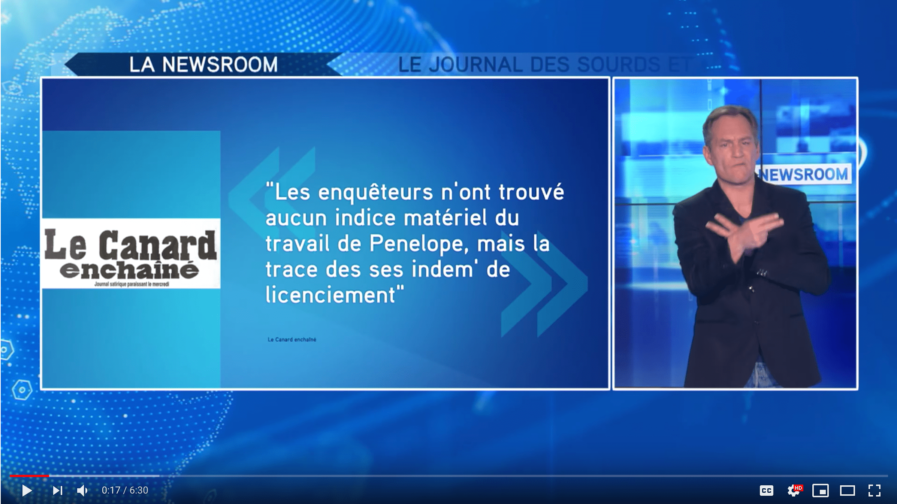

# Ideas 💡

I had a game when I was a child, trying to guess the future. Surprisingly some of my ideas became real. I certainly won't mention it now because afterward, it is impossible to know if it is true. 😁

I will list here new ideas I have - I will certainly won't develop as a business - and I will patiently wait for them to become a reality!

## Generative deep learning for Sign-language

Disable people disserve all our computer science attention. Today's technology can help them in their daily life. [Google Lookout](https://www.engadget.com/2018/05/08/google-lookout-app/) is an example: the phone is continuously describing the surrounding environment with words.

What about a GAN that will generate sign-language from speeches in real time.

Several hundreds of hours of sign language videos are available online and might serve as training data. [Example](https://www.youtube.com/watch?v=g79sOA3qy5U):

Several challenges:

* How to gather all the data?
* How to "align" speeches with sounds?
* How to handle cases where sign-language is not executed when text is displayed on the video?
* Is it necessary to do speech to text and then text to sign-language?

Actors:

* [Elioz](https://www.elioz.fr/) - Startup company with Human sign-language translators
